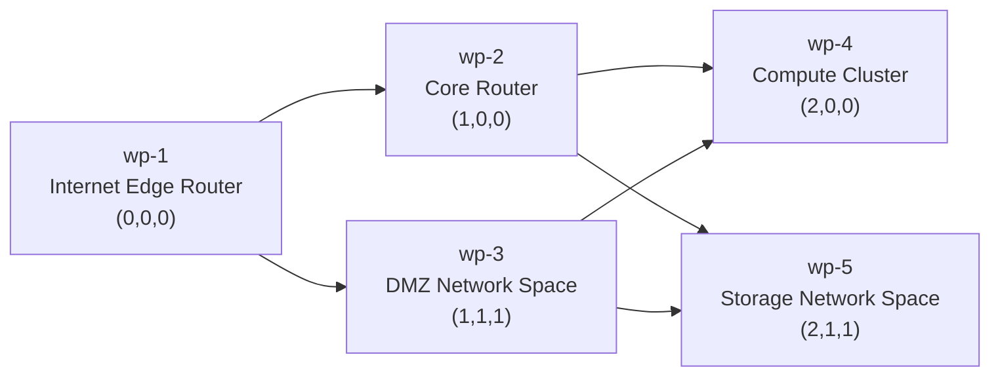

# DAG Workplane Product, Test, and Screenshot Plan

Research snapshot: 2026-04-08

## Progress Snapshot

- `Slice 1` complete:
  - added `src/dag-document.ts`
  - added DAG validation coverage in `scripts/test/unit.ts`
  - green command: `npm run test:dag:static`
  - invariant: DAG documents now prove single-root, acyclic, integer-position, reachable, non-dangling, left-to-right topology
- `Slice 2` complete:
  - added `src/dag-layout.ts`
  - added deterministic integer-to-world layout coverage in `scripts/test/unit.ts`
  - green command: `npm run test:dag:static`
  - invariant: integer `(column,row,layer)` positions now map to stable world origins, plane bounds, and title anchors
- `Slice 3` complete:
  - added pure DAG edge geometry coverage in `scripts/test/unit.ts`
  - added `resolveDagEdgeCurve()` and `src/dag-view.ts`
  - green command: `npm run test:dag:static`
  - invariant: DAG edges now resolve left to right and invalid references are skipped safely
- `Slice 4` complete:
  - added `src/data/network-dag.ts`
  - added canonical DAG fixture helpers in `scripts/test/fixtures.ts`
  - green command: `npm run test:dag:static`
  - invariant: the exact five-workplane network from this plan is now reusable and test-verified
- `Slice 5` complete:
  - added DAG compatibility rendering through `src/dag-view.ts` and `src/stack-view.ts`
  - added stable DAG browser datasets through `src/stage-snapshot.ts`, `src/app.ts`, and `scripts/test/browser.ts`
  - added focused browser flow `scripts/test/dag-view-smoke.ts`
  - green command: `npm run test:browser -- --flow dag-view-smoke`
  - invariant: the browser can now seed the canonical DAG, enter `3d-mode`, render all five DAG workplanes plus six dependencies, and keep the active workplane selectable
- `Slice 6` in progress:
  - added `resolveWorkplaneLod()`, `bucketVisibleDagNodes()`, and `createProjectedDagVisibleNodes()` in `src/dag-view.ts`
  - tightened LOD coverage in `scripts/test/unit.ts` and `scripts/test/dag-view-smoke.ts`
  - green commands: `npm run test:dag:static` and `npm run test:browser -- --flow dag-view-smoke`
  - invariant: projected workplane spans now classify close, mid, far, and universe views, and the canonical DAG smoke can reconstruct a root overview as `graph-point` plus a selected middle-workplane view as `title-only` from exported browser state

## Immediate Next Slice

- `Slice:` 6
- `Intent:` add screen-space LOD bucketing so the DAG view can collapse from full workplanes toward lighter-weight overview states
- `Own Files:` `src/dag-view.ts`, `scripts/test/unit.ts`, `scripts/test/dag-view-smoke.ts`, and only add `src/app.ts`, `src/stage-snapshot.ts`, or `scripts/test/browser.ts` when the browser dataset contract needs one more stable exported count
- `First Focused Command:` `npm run test:dag:static`
- `Second Focused Command:` `npm run test:browser -- --flow dag-view-smoke`
- `Datasets:` keep using the canonical five-workplane network DAG fixture already added in `src/data/network-dag.ts`
- `Artifacts:` none yet; no README screenshot update is required until the LOD states are stable enough to become part of the canonical screenshot sequence

Loop alignment rule for this and later slices:

- every non-review-only worker iteration must review and update both `README.md` and `PLAN.md`
- `README.md` should record the short workflow and the latest proven invariant
- `PLAN.md` should record the current slice status, the next narrow test, and any still-open risk
- the loop should pick one explicit task packet per run and keep the worker and monitor on that task until it is accepted
- the `/tasks` route should stay readable as the loop source of truth for task status, run history, command checks, and monitor review evidence
- the `/tasks` route should stay browser-smoke-tested so loop visibility does not drift from the real run artifacts

Slice 6 working notes:

- pure helpers are now green:
  - `resolveWorkplaneLod(projectedPlaneSpanPx)`
  - `bucketVisibleDagNodes(...)`
- the focused smoke is now green:
  - the root `3d-mode` overview reconstructs `5` visible `graph-point` workplanes
  - selecting `wp-2` reconstructs `5` visible `title-only` workplanes from the same exported browser state
- keep the next browser assertion narrow:
  - export active LOD bucket counts directly through `document.body.dataset`
  - widen from `graph-point` and `title-only` toward `label-points` and `full-workplane` only after the dataset contract is stable
- keep live-site tracking visible in the loop:
  - browser-backed loop runs should also record `npm run test:live -- --url https://timcash.github.io/linker/`
  - the monitor should report whether GitHub Pages smoke is green, even when the local slice proof is still incomplete
- do not start control-pad or canonical screenshot work in the same slice

Current task ladder for Slice 6:

1. `export-dag-lod-dataset`
   - export live DAG LOD bucket ids or counts through browser datasets
   - allow `src/app.ts` when the dataset fields need one more computed count before snapshot export
2. `assert-exported-root-selected-buckets`
   - tighten the smoke flow so it reads exported root and selected bucket fields directly
3. `prove-mid-near-lod-states`
   - widen coverage from `graph-point` and `title-only` into `label-points` and `full-workplane`

## Goal

Evolve `linker` from a vertical workplane stack editor into a general-purpose DAG tool where:

- each DAG node is one `workplane`
- each workplane still contains a local `12x12x12` label grid
- each workplane lives at an integer `column,row,layer` in global 3D space
- `2d-mode` is always the local projection of one workplane
- `3d-mode` is always the global DAG view
- the browser test is the source of truth for product behavior, screenshots, and regression coverage

## Product Rules

### Core DAG Rules

- there is exactly one root workplane
- every non-root workplane has at least one incoming dependency
- dependencies always point left to right by column
- if `B` depends on `A`, then `A.column < B.column`
- row and layer affect placement, not topology
- items in the same column are parallel peers
- a later column is considered blocked until its dependency columns are complete

### Workplane Rules

- a workplane remains a 2D editable plane with its own labels, links, and camera memory
- a workplane position is discrete and integer-based: `column,row,layer`
- moving a workplane changes its 3D placement, not its local 2D label coordinates
- switching back from `3d-mode` to `2d-mode` must restore the selected workplane and its remembered local camera target

### Visual Rules

- columns read left to right
- rows read top to bottom
- layers separate parallel planes in depth
- local links stay inside a workplane
- DAG links connect whole workplanes across the scene
- bridge links must visually respect the chosen line strategy in `3d-mode`

## Canonical Example Dataset

The first DAG scenario should be a five-workplane computer network.

| Workplane | Role | Integer Position `(column,row,layer)` | Depends On |
| --- | --- | --- | --- |
| `wp-1` | Internet Edge Router | `(0,0,0)` | root |
| `wp-2` | Core Router | `(1,0,0)` | `wp-1` |
| `wp-3` | DMZ Network Space | `(1,1,1)` | `wp-1` |
| `wp-4` | Compute Cluster | `(2,0,0)` | `wp-2`, `wp-3` |
| `wp-5` | Storage Network Space | `(2,1,1)` | `wp-2`, `wp-3` |

This gives us:

- one root
- one parallel column in the middle
- one dependent column on the right
- depth movement through `layer`
- both local and cross-workplane links

## Target DAG Layout



## Architecture Direction

### 1. Replace The Ordered Stack Model With A DAG Document Model

Current state:

- `src/plane-stack.ts` treats workplanes as an ordered stack
- `src/stack-view.ts` derives 3D placement from stack index only

New direction:

- replace `PlaneStackDocumentState` with a DAG-aware document model
- keep `workplanesById`
- add `rootWorkplaneId`
- replace `workplaneOrder` with:
  - topological order metadata
  - per-workplane integer placement
  - explicit DAG edge definitions

Suggested types:

- `WorkplaneDagPosition { column: number; row: number; layer: number }`
- `WorkplaneDagNodeState { workplaneId; position; scene; labelTextOverrides }`
- `WorkplaneDagEdgeState { edgeKey; fromWorkplaneId; toWorkplaneId }`
- `DagDocumentState { rootWorkplaneId; nodesById; edges; nextWorkplaneNumber }`

### 2. Split Topology From Layout

We should not let render code invent topology.

Add a dedicated DAG layout layer that:

- validates acyclic left-to-right structure
- computes world-space plane origins from integer coordinates
- computes graph bounds and orbit target
- resolves DAG edges into 3D bridge-link geometry

Suggested module split:

- `src/dag-document.ts`: DAG state, validation, mutations
- `src/dag-layout.ts`: integer DAG coordinates to world transforms
- `src/dag-view.ts`: render-scene assembly for `3d-mode`

`src/stack-view.ts` should either be replaced or reduced to a compatibility wrapper around `dag-view.ts`.

### 3. Keep 2D Workplane Editing Intact

We should preserve the current strength of the system:

- one workplane opens as a precise 2D editing surface
- local labels and local links remain authored inside that workplane
- camera memory remains per workplane

The new DAG layer should add global node movement and dependency editing without breaking local editing.

### 4. Make DAG Invariants Cheap To Test

Add validation helpers that are called by both runtime code and browser tests:

- `assertSingleRoot`
- `assertColumnsIncreaseAlongEdges`
- `assertIntegerWorkplanePositions`
- `assertReachableFromRoot`
- `assertNoDanglingEdgeReferences`

## Repository Alignment

This repo already has a working custom test harness. The DAG migration should fit that harness instead of inventing a second one.

### Current Seams To Build On

- `scripts/test/unit.ts` is the current static/unit assertion entrypoint through `runStaticUnitTests()`
- `scripts/test.ts` is the browser-flow switchboard and should stay that way
- `scripts/test/browser.ts` is the right place for browser-readable state helpers
- `scripts/test/assertions.ts` is the right place for reusable browser assertions
- `scripts/test/fixtures.ts` is the right place for browser-oriented state builders
- `src/plane-stack.ts` currently owns the main document/session types and is the safest place for compatibility adapters during migration
- `src/stack-view.ts` is the current 3D assembly layer and should be wrapped or replaced incrementally
- `src/stage-snapshot.ts` is the right place to export new `document.body.dataset` fields for tests and manual debugging

### Repo-Aware Implementation Rules

- do not introduce a second test framework
- do not bypass `scripts/test.ts` with one-off browser runners
- do not make browser tests scrape random DOM fragments when the same state should be exported through `document.body.dataset`
- do not remove legacy stack behavior until the new DAG browser flows are green
- prefer compatibility adapters over a full state-model rewrite in one step

### How New Tests Should Plug In

For pure logic:

- add new grouped functions inside `scripts/test/unit.ts`
- expected first additions:
  - `runDagDocumentTests()`
  - `runDagLayoutTests()`
  - `runDagViewTests()`
- call those from `runStaticUnitTests()`
- if pure DAG work becomes frequent, add a tiny static-only command that calls the existing `runStaticUnitTests()` path without launching Chrome

For browser flows:

- add one focused flow file per slice under `scripts/test/`
- register each flow in `scripts/test.ts` behind an explicit `--flow` name
- only add a `package.json` shortcut when a flow becomes part of the regular development loop

For browser-readable state:

- extend the types and readers in `scripts/test/browser.ts`
- extend the exported datasets in `src/stage-snapshot.ts`
- keep test-facing names stable once a flow depends on them

### 5. 3D DAG Layout Implementation Examples

The renderer should place workplanes from integer DAG coordinates, not from list index.

Suggested spacing constants:

- `WORLD_COLUMN_STEP = 48`
- `WORLD_ROW_STEP = 34`
- `WORLD_LAYER_STEP = 18`
- `WORKPLANE_HALF_WIDTH = 12`
- `WORKPLANE_HALF_HEIGHT = 12`

Example integer-to-world placement:

```ts
export type WorkplaneDagPosition = {
  column: number;
  row: number;
  layer: number;
};

export type DagNodeWorldLayout = {
  workplaneId: WorkplaneId;
  origin: {x: number; y: number; z: number};
  titleAnchor: {x: number; y: number; z: number};
  planeBounds: {
    minX: number;
    maxX: number;
    minY: number;
    maxY: number;
    z: number;
  };
};

const WORLD_COLUMN_STEP = 48;
const WORLD_ROW_STEP = 34;
const WORLD_LAYER_STEP = 18;
const WORKPLANE_HALF_WIDTH = 12;
const WORKPLANE_HALF_HEIGHT = 12;

export function layoutDagNode(
  workplaneId: WorkplaneId,
  position: WorkplaneDagPosition,
): DagNodeWorldLayout {
  const origin = {
    x: position.column * WORLD_COLUMN_STEP,
    y: -position.row * WORLD_ROW_STEP,
    z: -position.layer * WORLD_LAYER_STEP,
  };

  return {
    workplaneId,
    origin,
    titleAnchor: {
      x: origin.x,
      y: origin.y + WORKPLANE_HALF_HEIGHT + 4,
      z: origin.z,
    },
    planeBounds: {
      minX: origin.x - WORKPLANE_HALF_WIDTH,
      maxX: origin.x + WORKPLANE_HALF_WIDTH,
      minY: origin.y - WORKPLANE_HALF_HEIGHT,
      maxY: origin.y + WORKPLANE_HALF_HEIGHT,
      z: origin.z,
    },
  };
}
```

Example DAG edge resolution:

```ts
export type DagEdgeState = {
  edgeKey: string;
  fromWorkplaneId: WorkplaneId;
  toWorkplaneId: WorkplaneId;
};

export function resolveDagEdgeCurve(
  edge: DagEdgeState,
  nodeLayoutsById: Map<WorkplaneId, DagNodeWorldLayout>,
) {
  const fromNode = nodeLayoutsById.get(edge.fromWorkplaneId);
  const toNode = nodeLayoutsById.get(edge.toWorkplaneId);

  if (!fromNode || !toNode) {
    return null;
  }

  return {
    edgeKey: edge.edgeKey,
    output: {
      x: fromNode.planeBounds.maxX,
      y: fromNode.origin.y,
      z: fromNode.origin.z,
    },
    input: {
      x: toNode.planeBounds.minX,
      y: toNode.origin.y,
      z: toNode.origin.z,
    },
  };
}
```

This gives the graph a readable left-to-right structure while preserving row and layer separation.

Example DAG view assembly:

```ts
export type DagViewState = {
  backplates: DagNodeWorldLayout[];
  labelPointClouds: DagNodeWorldLayout[];
  titleBillboards: DagNodeWorldLayout[];
  universePoints: DagNodeWorldLayout[];
  edges: ReturnType<typeof resolveDagEdgeCurve>[];
};

export function createDagViewState(document: DagDocumentState, camera: StackCameraState): DagViewState {
  const nodeLayouts = Object.values(document.nodesById).map((node) =>
    layoutDagNode(node.workplaneId, node.position),
  );
  const nodeLayoutsById = new Map(nodeLayouts.map((node) => [node.workplaneId, node]));
  const visibleNodes = nodeLayouts.map((layout) => ({
    layout,
    projectedPlaneSpanPx: estimateProjectedPlaneSpan(layout, camera),
  }));
  const lodBuckets = bucketVisibleDagNodes(visibleNodes);
  const edges = document.edges
    .map((edge) => resolveDagEdgeCurve(edge, nodeLayoutsById))
    .filter((edge): edge is NonNullable<typeof edge> => edge !== null);

  return {
    backplates: lodBuckets.fullWorkplanes,
    labelPointClouds: lodBuckets.labelPointWorkplanes,
    titleBillboards: lodBuckets.titleOnlyWorkplanes,
    universePoints: lodBuckets.graphPointWorkplanes,
    edges,
  };
}
```

That function is the conceptual replacement for the current vertical-stack-only scene assembly.

### 6. Level Of Detail Rules

The 3D DAG view should use screen-space LOD, not just raw world zoom.

The intended progression is:

1. Near view:
   - full workplane backplate
   - local labels rendered as text
   - local links visible
   - DAG edges visible
2. Mid view:
   - workplane backplate still visible
   - local labels collapse into points
   - local links may be thinned or hidden
   - DAG edges remain visible
3. Far view:
   - workplane plane collapses to a title-only billboard
   - local label points disappear
   - DAG edges remain visible
4. Universe view:
   - each workplane collapses to one point
   - only DAG points and DAG lines remain
   - title text is suppressed

Suggested LOD type:

```ts
export type WorkplaneLod =
  | 'full-workplane'
  | 'label-points'
  | 'title-only'
  | 'graph-point';
```

Suggested screen-space threshold logic:

```ts
export function resolveWorkplaneLod(projectedPlaneSpanPx: number): WorkplaneLod {
  if (projectedPlaneSpanPx >= 180) {
    return 'full-workplane';
  }

  if (projectedPlaneSpanPx >= 72) {
    return 'label-points';
  }

  if (projectedPlaneSpanPx >= 22) {
    return 'title-only';
  }

  return 'graph-point';
}
```

Suggested render bucketing:

```ts
export type DagLodBuckets = {
  fullWorkplanes: DagNodeWorldLayout[];
  labelPointWorkplanes: DagNodeWorldLayout[];
  titleOnlyWorkplanes: DagNodeWorldLayout[];
  graphPointWorkplanes: DagNodeWorldLayout[];
};

export function bucketVisibleDagNodes(
  visibleNodes: Array<{layout: DagNodeWorldLayout; projectedPlaneSpanPx: number}>,
): DagLodBuckets {
  const buckets: DagLodBuckets = {
    fullWorkplanes: [],
    labelPointWorkplanes: [],
    titleOnlyWorkplanes: [],
    graphPointWorkplanes: [],
  };

  for (const node of visibleNodes) {
    switch (resolveWorkplaneLod(node.projectedPlaneSpanPx)) {
      case 'full-workplane':
        buckets.fullWorkplanes.push(node.layout);
        break;
      case 'label-points':
        buckets.labelPointWorkplanes.push(node.layout);
        break;
      case 'title-only':
        buckets.titleOnlyWorkplanes.push(node.layout);
        break;
      case 'graph-point':
        buckets.graphPointWorkplanes.push(node.layout);
        break;
    }
  }

  return buckets;
}
```

### 7. Scaling Strategy For Thousands Of Workplanes

To keep the DAG usable at large scale, the renderer should batch by LOD and avoid per-node draw calls.

Rules:

- draw full workplanes with instanced backplate geometry
- draw title-only nodes with instanced title billboards
- draw universe nodes with one instanced point cloud
- batch DAG edges into one or a few large line buffers
- cache workplane world origins and plane bounds until topology or integer position changes
- rebuild only dirty node and edge ranges
- cull by frustum and projected size before generating expensive text data
- stop submitting local label text for workplanes below `full-workplane`
- stop submitting local label points for workplanes below `label-points`

Suggested renderer split:

- `DagBackplateLayer`: instanced workplane planes
- `DagLabelPointLayer`: instanced local label points
- `DagTitleLayer`: instanced title billboards
- `DagUniversePointLayer`: instanced workplane points
- `DagEdgeLayer`: batched dependency lines

The main scale trick is:

- a full-detail minority of workplanes
- a much larger title-only band
- a very large universe-point band

That should let the renderer show thousands of workplanes while only a small fraction pay full text and local-detail cost.

### 8. Renderer Telemetry And Performance Tracking

The plan should explicitly keep performance visible over time.

We already have a good base in:

- `src/perf.ts`
- `src/stage-snapshot.ts`

We should extend that system for DAG rendering instead of inventing a second telemetry path.

Keep tracking:

- `cpuFrameAvgMs`
- `cpuFrameMaxMs`
- `frameGapAvgMs`
- `gpuFrameAvgMs`
- `gpuTextAvgMs`
- uploaded bytes per frame
- visible glyph count
- submitted vertex count
- line visible count

Add DAG-specific stats:

- `dagVisibleWorkplaneCount`
- `dagVisibleEdgeCount`
- `dagFullWorkplaneCount`
- `dagLabelPointWorkplaneCount`
- `dagTitleOnlyWorkplaneCount`
- `dagUniversePointWorkplaneCount`
- `dagSubmittedBackplateInstanceCount`
- `dagSubmittedLabelPointCount`
- `dagSubmittedTitleCount`
- `dagSubmittedUniversePointCount`
- `dagCpuLayoutAvgMs`
- `dagCpuCullingAvgMs`
- `dagCpuEdgeBuildAvgMs`
- `dagGpuEdgeAvgMs` if supported
- `dagGpuNodeAvgMs` if supported

Suggested stage snapshot additions:

```ts
document.body.dataset.dagVisibleWorkplaneCount = String(stats.visibleWorkplaneCount);
document.body.dataset.dagVisibleEdgeCount = String(stats.visibleEdgeCount);
document.body.dataset.dagFullWorkplaneCount = String(stats.fullWorkplaneCount);
document.body.dataset.dagLabelPointWorkplaneCount = String(stats.labelPointWorkplaneCount);
document.body.dataset.dagTitleOnlyWorkplaneCount = String(stats.titleOnlyWorkplaneCount);
document.body.dataset.dagUniversePointWorkplaneCount = String(stats.graphPointWorkplaneCount);
document.body.dataset.dagCpuLayoutAvgMs = stats.cpuLayoutAvgMs.toFixed(3);
document.body.dataset.dagCpuCullingAvgMs = stats.cpuCullingAvgMs.toFixed(3);
```

Suggested browser perf assertions:

- full-detail close shot should keep visible full workplanes low
- far shot should reduce glyph count sharply
- universe shot should reduce submitted vertex count per workplane
- `gpuFrameAvgMs` should not rise linearly with total workplane count if most workplanes are in `graph-point`
- `bytesUploadedPerFrame` should remain bounded while orbiting without topology changes

We should also add one large-scene regression fixture:

- `1024` workplanes
- `4096` workplanes
- same DAG topology pattern repeated in columns

The purpose of these perf runs is not just to pass once, but to build historical renderer budgets over time.

## Mobile 3x3 Control Pad Direction

The control pad should stay mobile-first and every page should remain a `3x3` grid.

The simplest clean direction is to make the toggle cycle through multiple `3x3` pages instead of trying to overstuff one page.

### Page 1. Navigate

- zoom in
- pan up
- zoom out
- pan left
- reset camera
- pan right
- orbit mode chip / view chip
- pan down
- toggle

### Page 2. DAG

- set `2d-mode`
- focus root
- set `3d-mode`
- previous workplane
- active workplane chip
- next workplane
- new child workplane
- delete workplane
- toggle

### Page 3. Move

- move column left
- move row up
- move layer out
- move column right
- recenter active workplane
- move layer in
- snap to DAG rails
- move row down
- toggle

### Page 4. Edit

- label input / save
- select or create
- link
- unlink
- remove
- clear
- focus parent
- focus child
- toggle

### Page 5. Style

- text style previous
- text style chip
- text style next
- line style previous
- line style chip
- line style next
- layout style previous
- layout style next
- toggle

Hotkeys should mirror these buttons so the browser test can prove both pointer and keyboard paths in the same tab session.

## Source-Of-Truth Test Strategy

The long-term goal is one canonical browser flow that proves the product end to end.

Suggested canonical flow:

- file: `scripts/test/dag-network-build.ts`
- run in one Chrome tab instance
- starts from zero data
- builds the five-workplane network DAG step by step
- never resets the page
- uses every control-pad page
- uses every button category at least once
- uses the corresponding hotkeys at least once
- captures the screenshots that become the product guide

### Browser Data Contract For DAG Tests

The first browser-facing DAG slice should add stable state exports so future tests do not need to rediscover renderer internals.

Minimum new dataset fields:

- `dagRootWorkplaneId`
- `dagNodeCount`
- `dagEdgeCount`
- `dagActiveWorkplaneColumn`
- `dagActiveWorkplaneRow`
- `dagActiveWorkplaneLayer`
- `dagVisibleWorkplaneCount`
- `dagVisibleEdgeCount`
- `dagFullWorkplaneCount`
- `dagLabelPointWorkplaneCount`
- `dagTitleOnlyWorkplaneCount`
- `dagUniversePointWorkplaneCount`
- `dagLayoutFingerprint`
- `dagCameraPreset`

These should be:

- exported from `src/stage-snapshot.ts`
- read through `scripts/test/browser.ts`
- asserted in browser flows before pixel-level screenshot checks

### What The Canonical Test Must Cover

1. Boot an empty DAG with one root workplane.
2. Name the root workplane and author at least one local label stack.
3. Spawn four additional workplanes.
4. Move workplanes to the planned integer DAG coordinates.
5. Name each workplane according to the network scenario.
6. Author representative local content:
   - routers
   - network ranges
   - compute nodes
   - storage labels
7. Create DAG dependencies between workplanes.
8. Verify all DAG edges point to a later column.
9. Enter `3d-mode` and verify the 3D DAG layout.
10. Verify the first LOD transition where local labels collapse to points.
11. Verify the second LOD transition where workplanes collapse to title-only billboards.
12. Verify the universe LOD where the DAG becomes points and lines.
13. Change line strategy and verify bridge-link geometry changes.
14. Change text strategy and verify route/state stays in sync.
15. Move at least one workplane in 3D, then verify the new integer position.
16. Return to `2d-mode` and verify per-workplane camera memory is preserved.
17. Delete and reinsert one non-root workplane only if the DAG remains valid.
18. End on a clean five-workplane network DAG overview.

### What The Test Should Assert

- `rootWorkplaneId` is stable
- workplane count is exactly `5`
- each workplane position is integer-valued
- each DAG edge points from a smaller column to a larger column
- the `3d-mode` scene renders all five workplanes
- bridge-link count matches the expected dependency count
- the close view uses `full-workplane` LOD
- the mid view uses `label-points` LOD
- the far view uses `title-only` LOD
- the universe view uses `graph-point` LOD
- switching workplanes in `3d-mode` restores remembered `2d-mode` targets
- visible glyph counts fall as LOD increases
- submitted point and title instance counts match the active LOD bucket
- screenshot capture names match the documented product steps

## Screenshot Plan

Screenshots are not decoration. They are part of the contract.

The browser test should save stable screenshots under one ordered scenario.

Suggested sequence:

1. `01-dag-empty-root.png`
   Shows the booted root workplane in `2d-mode`.
2. `02-dag-root-router-authored.png`
   Shows the first authored router workplane.
3. `03-dag-two-column-shape.png`
   Shows root plus the first spawned dependency column.
4. `04-dag-five-workplane-2d-focus.png`
   Shows the local detail inside one downstream workplane.
5. `05-dag-five-workplane-3d-overview.png`
   Shows the full DAG from a stable overview orbit.
6. `06-dag-label-points-lod.png`
   Shows the first zoomed-out transition where local labels become points.
7. `07-dag-title-only-lod.png`
   Shows the second transition where each workplane becomes title-only.
8. `08-dag-universe-view.png`
   Shows the whole DAG as points and dependency lines.
9. `09-dag-bridge-links-arc.png`
   Shows the same DAG after switching line strategy.
10. `10-dag-moved-node-3d.png`
   Shows a workplane moved to a new integer `column,row,layer`.
11. `11-dag-return-to-2d-memory.png`
   Shows that the workplane returns to its remembered local view.

### Screenshot Rules

- use stable camera presets before capture
- keep the phone aspect ratio fixed
- capture after UI settles, not during animation
- couple screenshots with scene-stat assertions
- prefer one screenshot per product claim, not dozens of redundant captures

### 3D Screenshot Validation Rules

For 3D captures, validate:

- visible workplane count
- visible bridge-link count
- active workplane id
- active line strategy
- active text strategy
- active workplane integer position
- active workplane LOD bucket counts
- visible glyph count versus point/title counts

If the renderer remains deterministic enough, we can also keep a light pixel signature check, but the primary truth should be:

- graph state
- route state
- named screenshot artifact

## LLM Agent Execution Guide

This plan should be executable by an LLM agent in small green slices.

The agent should follow these rules:

- implement one testable slice at a time
- write or update the smallest test that proves that slice
- make the minimum production change needed to pass that test
- run only the focused test first
- run `npm run lint` after each completed slice
- run the full browser suite only after a milestone boundary
- do not replace multiple subsystems at once if one pure-data layer can be finished first
- do not remove the current stack code path until the DAG test path is stable

### Agent Stop Rule

After every slice, the agent must be able to answer:

- what exact behavior is now covered by tests
- which focused command is green
- what new invariant is now guaranteed

If it cannot answer those three questions clearly, the slice is too large.

### Recommended Working Loop

1. Add or update the focused test.
2. Run the focused test and watch it fail for the expected reason.
3. Implement the smallest production change.
4. Re-run the focused test until green.
5. Run `npm run lint`.
6. If the slice changes visible behavior, update screenshot expectations or the artifact plan.
7. Only then move to the next slice.

### Repo Conventions For The Agent

Use the current repo split rather than inventing a new one:

- pure data/layout validation tests should live with the existing static/unit test approach
- browser interaction flows should live under `scripts/test/`
- focused browser entry points should be exposed through `scripts/test.ts`
- screenshot-producing flows should keep using the existing browser artifact path and naming style

### Agent Build Contract

Each slice prompt should name five things explicitly:

- the slice number from this plan
- the exact files the agent owns
- the exact focused command it must make green
- whether new `document.body.dataset` fields are part of the slice
- whether screenshots are expected to change

Each slice completion note should report:

- what test was added or tightened
- which command is now green
- which new invariant is guaranteed
- which next slice is now unblocked

If a slice needs more than one new browser flow and more than one new production subsystem at the same time, it is probably too large and should be split.

## Test-First Implementation Ladder

The new DAG system should be built in this order.

### Slice 1. DAG Validation Primitives

Files to add:

- `src/dag-document.ts`
- DAG validation coverage inside `scripts/test/unit.ts`

Test goal:

- verify single root
- verify no cycles
- verify left-to-right column ordering
- verify all positions are integers
- verify every node is reachable from the root

Done when:

- pure validation tests are green without touching rendering
- `runStaticUnitTests()` contains a clearly named DAG validation block

### Slice 2. Integer DAG Layout

Files to add:

- `src/dag-layout.ts`
- DAG layout coverage inside `scripts/test/unit.ts`

Test goal:

- a node at `(0,0,0)` maps to the root world origin
- later columns move right
- later rows move downward
- later layers move deeper in `z`
- plane bounds and title anchors are deterministic

Done when:

- pure layout tests are green
- no browser rendering changes are required yet

### Slice 3. DAG Edge Geometry

Files to add or extend:

- `src/dag-layout.ts`
- `src/dag-view.ts`
- DAG edge coverage inside `scripts/test/unit.ts`

Test goal:

- every DAG edge resolves from the right side of the source workplane to the left side of the target workplane
- cross-row and cross-layer edges still flow left to right
- invalid node references are skipped safely

Done when:

- edge geometry tests are green

### Slice 4. DAG Fixture For The Five-Workplane Network

Files to add:

- `scripts/test/fixtures.ts` DAG network fixture helpers
- one reusable DAG fixture in `src/data/`

Test goal:

- fixture creates the exact five-workplane network described in this plan
- root and dependency columns are correct
- expected dependency count is correct

Done when:

- the fixture is validated by tests before UI work starts

### Slice 5. 3D DAG Scene Assembly

Files to add or replace:

- `src/dag-view.ts`
- `src/stack-view.ts` compatibility layer or replacement
- `src/stage-snapshot.ts`
- `scripts/test/browser.ts`

Focused browser flow:

- `scripts/test/dag-view-smoke.ts`

Test goal:

- entering `3d-mode` renders the network fixture in DAG positions, not vertical stack positions
- visible bridge-link count matches dependency count
- active workplane is still selectable

Done when:

- the first DAG browser smoke test is green
- browser-readable DAG counts are available through `scripts/test/browser.ts`

### Slice 6. LOD Bucketing

Files to add or extend:

- `src/dag-view.ts`
- new DAG node layers if needed

Focused tests:

- unit test for `resolveWorkplaneLod`
- browser test for close, mid, far, and universe transitions

Test goal:

- local labels become points at the first threshold
- workplanes become title-only at the second threshold
- workplanes become graph points at the final threshold

Done when:

- the browser test proves all four LOD states
- visible glyph counts and LOD bucket counts change as expected

### Slice 7. Control Pad DAG Operations

Files to extend:

- `src/stage-chrome.ts`
- `src/stage-panels.ts`
- `src/app.ts`
- `scripts/test/browser.ts`

Focused browser flow:

- `scripts/test/dag-control-pad.ts`

Test goal:

- each new `3x3` page is reachable by the toggle
- DAG movement buttons update integer node positions
- hotkeys mirror those controls

Done when:

- every DAG page has at least one passing assertion and one passing hotkey path

### Slice 8. Canonical Zero-To-Network Build Flow

Files to add:

- `scripts/test/dag-network-build.ts`
- flow selection in `scripts/test.ts`
- optional `package.json` shortcut once the flow stabilizes

Test goal:

- one browser tab
- zero data start
- build all five workplanes
- add dependencies
- move nodes
- switch LODs
- switch styles
- return to `2d-mode`
- capture all canonical screenshots

Done when:

- this single flow is green by itself
- it produces the canonical screenshot sequence

### Slice 9. Renderer Telemetry Assertions

Files to extend:

- `src/perf.ts`
- `src/stage-snapshot.ts`
- `scripts/test/browser.ts`
- browser perf helper tests

Test goal:

- DAG bucket counts and DAG timing stats appear in body datasets
- browser tests can assert close versus universe budgets
- orbiting a large DAG does not trigger runaway upload cost

Done when:

- focused perf regression tests are green

### Slice 10. Full-Suite Consolidation

Files to extend:

- `scripts/test.ts`
- README screenshot publishing flow if needed

Test goal:

- the canonical DAG build flow is the primary screenshot source
- overlapping old stack-only flows are removed, reduced, or clearly marked as legacy coverage

Done when:

- a fresh agent can run one focused DAG flow and one full suite without ambiguity

## Suggested Focused Commands

Already available today:

- `npm run lint`
- `npm run test:dag:static`
- `npm run test:browser -- --flow dag-view-smoke`
- `npm run test:browser:zero-data`
- `npm run test:browser`

Commands that should be added during the DAG migration:

- `npm run test:browser -- --flow dag-control-pad`
- `npm run test:browser -- --flow dag-network-build`

Recommended command ladder:

1. pure DAG slices: `npm run test:dag:static` and `npm run lint`
2. first DAG render slice: `npm run test:browser -- --flow dag-view-smoke`
3. loop-visibility slice: `npm run test:browser:tasks`
4. control-pad slice: `npm run test:browser -- --flow dag-control-pad`
5. canonical DAG flow slice: `npm run test:browser -- --flow dag-network-build`
6. milestone pass: `npm run test:browser`

The agent should prefer the most focused command possible until a milestone is complete.

## Slice Ledger Template

Every DAG slice should be recorded in this format in the working notes or commit summary:

- `Slice:` the numbered slice from this plan
- `Intent:` the single behavior being introduced
- `Test:` the exact test or flow added or changed
- `Green Command:` the narrowest command that passes
- `New Invariant:` the behavior now guaranteed
- `Artifacts:` `none` or the screenshot names affected

If a future agent cannot fill in all six lines cleanly, it should narrow the slice before writing code.

## Prompting Guidance For A Future LLM Agent

If this plan is handed to another LLM agent, the prompt should explicitly name:

- the exact slice from the implementation ladder
- the exact files it owns for that slice
- the exact focused command it must make pass
- whether screenshots are expected to change

Example prompt shape:

```text
Implement Slice 3 from PLAN.md.
Work only on DAG edge geometry.
Own these files: src/dag-layout.ts, src/dag-view.ts, related tests.
First make the focused edge-geometry tests fail for the expected reason, then make them pass.
Do not start control-pad or screenshot work yet.
Finish by running npm run lint and the focused DAG test command.
```

That structure should keep an LLM from trying to solve the whole DAG migration in one jump.

## Delivery Phases

### Phase 1. DAG Data Model

- add DAG node position and edge types
- add root handling
- add DAG validation helpers
- keep current editor scenes per workplane

### Phase 2. DAG View Layout

- replace stack-index depth placement with integer DAG placement
- compute world origin from `(column,row,layer)`
- update orbit target and scene bounds
- render DAG bridge links in the new layout

### Phase 3. Control Pad Rework

- expand the toggle to cycle through the new `3x3` pages
- keep button hit targets phone-friendly
- add hotkey parity for node movement and dependency editing

### Phase 4. Canonical Network Scenario

- add the five-workplane network fixture
- support building the same fixture from zero data through the UI
- make this flow the product demo and the README showcase source

### Phase 5. Source-Of-Truth Test Consolidation

- add one canonical end-to-end DAG build flow
- retire or reduce overlapping browser flows once coverage is absorbed
- publish screenshots from this one flow

## Acceptance Criteria

The first DAG milestone is complete when:

- Linker opens as a DAG tool, not just a vertical stack tool
- five workplanes can be arranged by integer `column,row,layer`
- all dependencies point left to right
- `3d-mode` shows a readable DAG overview
- `2d-mode` remains the detailed local workplane editor
- the mobile control pad stays usable at phone aspect ratios
- one browser flow builds the network DAG from zero data in one tab
- that flow produces the canonical screenshots

## Non-Goals For The First Milestone

- arbitrary freeform floating-point node placement
- multiple roots
- cycle-tolerant graphs
- replacing the local workplane grid model
- full graph auto-layout beyond integer DAG rails

## Summary

The next version of Linker should be a DAG editor whose nodes are workplanes, whose topology is enforced by integer columns, and whose main product story is a five-workplane computer-network scenario. The implementation should be driven by one canonical browser test that builds the graph from zero data, exercises every control-pad concept in one tab, and produces the screenshots we use to judge the 3D canvas.
