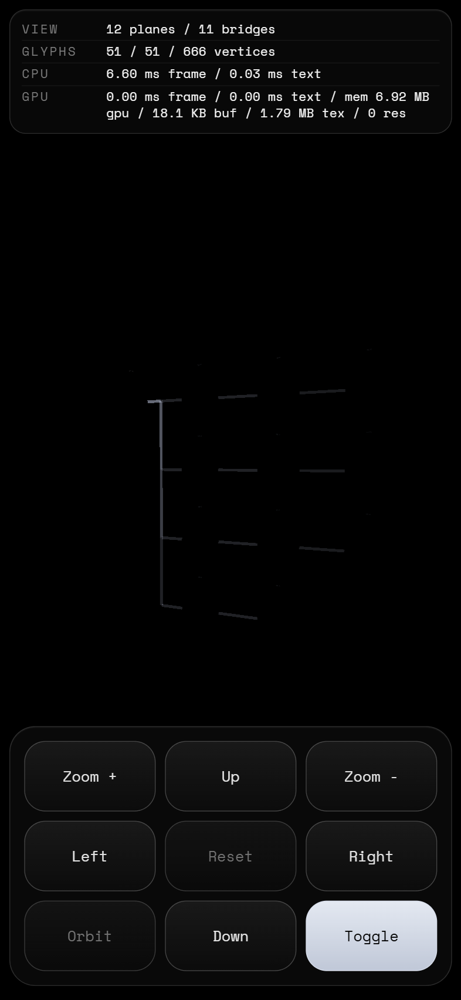
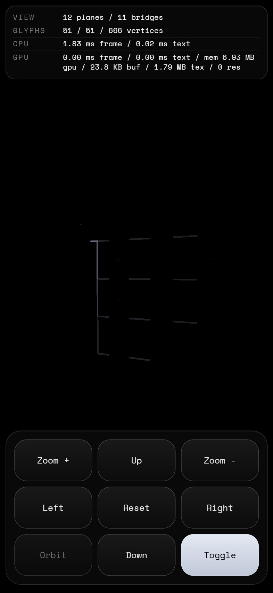
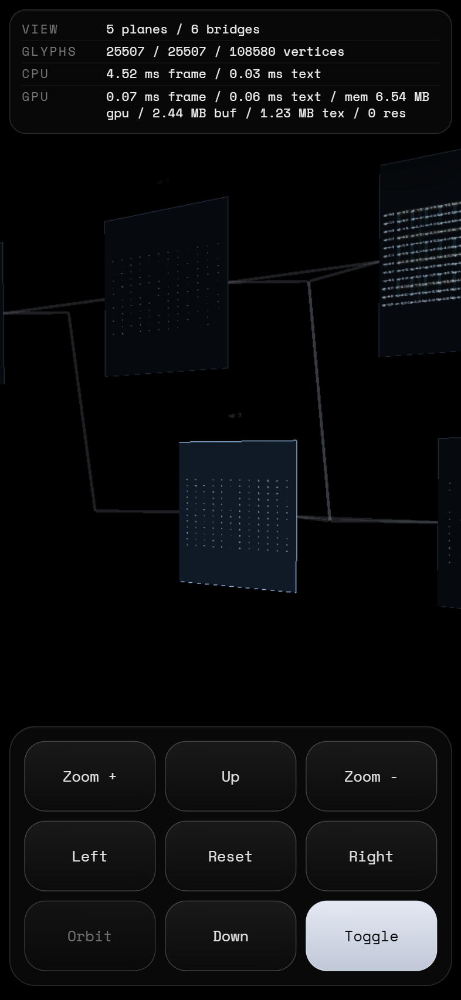
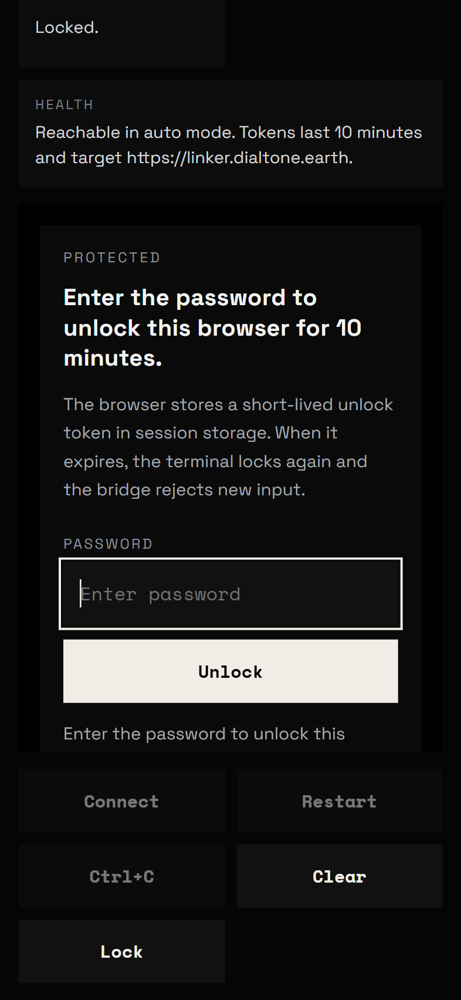

# Linker

Linker is a `luma.gl` + WebGPU DAG workplane viewer and editor with aligned `12x12x12` label grids, `rank/lane/depth` 3D navigation, a compact mobile-style control pad, and a browser `/codex` terminal page that can talk to a locally hosted bridge through Cloudflare.

## 1. Live Onboarding

First-time GitHub Pages visits now boot from `demoPreset=dag-empty` and replace the top stats strip with an `onboard-panel`. The guided run uses the same visible control-pad buttons and label input that Linker exposes to the user:

- create and rename a local label stack on the root workplane
- create, remove, and clear a local label selection and local link
- demonstrate `child`, `parent`, and leaf `delete` DAG CRUD
- build the full `1-4-4-3` twelve-workplane DAG from zero data
- move a leaf across `rank`, `lane`, and `depth`, then settle it back onto the rails
- enter `3d-mode`, orbit and zoom the graph, switch selected workplanes, and flip link/text styles
- finish on the root-focused 3D DAG overview

Current proven invariant:

- `npm run test:browser:onboarding` is green for the hosted-style introduction
- `npm run test:browser:dag-network-build` is green for the canonical zero-data 2D + 3D interaction proof
- `npm run test:dag:static` is green for pure DAG validation, layout, edge, and model mutation rules
- `npm run build:pages` is green for the deployable GitHub Pages bundle

Replay and skip:

- the hosted root auto-runs onboarding on a true first visit
- `?onboarding=1` forces a replay
- `?onboarding=0` skips the intro and boots the regular DAG route
- after a completion or a skip, Linker stores a local completion flag and later hosted visits return to the normal DAG overview

Focused working loop:

```bash
npm run test:dag:static
npm run lint
npm run test:browser:onboarding
npm run test:browser:dag-network-build
npm run test:browser:dag-rank-fanout
npm run test:browser
npm run build:pages
npm run test:live -- --url https://timcash.github.io/linker/ --expect-onboarding
```

Use [PLAN.md](PLAN.md) for the full slice ledger, the zero-data interaction checklist, the screenshot contract, and the next narrow DAG task.

## 2. Screenshot and Links

<!-- README_SHOWCASE:START -->

<table>
  <tr>
    <td align="center"><a href="https://timcash.github.io/linker/"></a><br/><sub>Boot</sub></td>
    <td align="center"><a href="https://timcash.github.io/linker/?demoPreset=dag-rank-fanout&stageMode=3d-mode&workplane=wp-1&cameraLabel=wp-1%3A1%3A3%3A3"></a><br/><sub>DAG Build</sub></td>
    <td align="center"><a href="https://timcash.github.io/linker/?demoPreset=dag-rank-fanout&stageMode=3d-mode&workplane=wp-3&cameraLabel=wp-3%3A1%3A6%3A6"></a><br/><sub>Zoom Detail</sub></td>
    <td align="center"><a href="https://timcash.github.io/linker/codex/"></a><br/><sub>Codex</sub></td>
  </tr>
</table>

- Live root: [timcash.github.io/linker](https://timcash.github.io/linker/)
- GitHub repository: [github.com/timcash/linker](https://github.com/timcash/linker)

The live root now opens into the automated onboarding walkthrough on a first visit, then settles on the same DAG-first product path shown in the screenshots below.
<!-- README_SHOWCASE:END -->

Local dev URL: `http://127.0.0.1:5173/`

Docs routes:

- `/auth/`
- `/codex/`
- `/tasks/`
- `/readme/`

To choose the dataset and focused label on the live page, only change these query params:

```text
onboarding=0|1
demoPreset=classic|dag-empty|dag-rank-fanout|editor-lab
cameraLabel=workplane-id:layer:row:column
```

Example:

```text
https://timcash.github.io/linker/?demoPreset=dag-rank-fanout&cameraLabel=wp-3:1:6:6
```

`/codex/` on GitHub Pages stays static and talks to the bridge origin selected by the page. For local development:

```bash
Copy-Item .env.codex.local.example .env.codex.local
npm run codex:bridge
npm run dev -- --host 127.0.0.1
```

If you want the browser route to reach this machine from GitHub Pages through Cloudflare, bring up the daemon or tunnel flow after setting the real env values:

```bash
npm run codex:daemon:start
npm run codex:daemon:status
npm run codex:tunnel
```

## 3. CLI Workflow

```bash
npm install --legacy-peer-deps

npm run dev -- --host 127.0.0.1
npm run lint
npm run build
npm run build:pages
npm run preview -- --host 127.0.0.1

npm run codex:bridge
npm run codex:daemon:start
npm run codex:daemon:status
npm run codex:daemon:stop
npm run codex:tunnel

npm run test:dag:static
npm run test:browser:boot
npm run test:browser:auth
npm run test:browser:codex
npm run test:browser:dag-control-pad
npm run test:browser:dag-network-build
npm run test:browser:onboarding
npm run test:browser:dag-rank-fanout
npm run test:browser:dag-rank-fanout:open
npm run test:browser:dag-zoom-journey
npm run test:browser -- --flow dag-view-smoke
npm run test:browser:readme
npm run test:browser:tasks
npm run test:browser:zero-data
npm run test:codex:bridge
npm run test:browser
npm run test:preview
npm run test:live -- --url https://timcash.github.io/linker/
npm run test:live -- --url https://timcash.github.io/linker/ --expect-onboarding
npm run test:live -- --url https://timcash.github.io/linker/codex/
npm run test:live -- --url https://timcash.github.io/linker/ --allow-unsupported
npm test

npm run perf:trace -- --stage-mode 3d-mode --label-set benchmark --label-count 4096 --orbit-count 1
npm run perf:orbit-stutter -- --label-set benchmark --label-count 4096 --segment-count 3
```

## 4. Domain Language

- `label key`: the canonical id format `workplane-id:layer:row:column`, for example `wp-3:2:6:12`
- `workplane id`: the `wp-N` id for one workplane
- `layer`, `row`, `column`: the canonical navigation axes inside a workplane
- `grid cell`: one `row,column` slot on a workplane
- `label stack`: all authored layers for one grid cell
- `grid stack`: the full `12x12x12` lattice for one workplane
- `plane-stack`: the ordered multi-workplane document
- `active workplane`: the selected workplane in the `plane-stack`
- `plane-focus view`: the single-workplane `2d-mode`
- `stack view`: the multi-workplane `3d-mode`
- `bridge link`: a link between different workplanes
- `local link`: a link inside one workplane
- `editor cursor`: the current editable `workplane/layer/row/column`
- `ghost slot`: an empty adjacent grid cell shown as a creation target
- `ranked selection`: the ordered label selection used for link creation
- `workplane node`: one workplane treated as a DAG node in global `3d-mode`
- `rank`: the left-to-right dependency stage for a workplane node; the UX term for global DAG `column`
- `lane`: the top-to-bottom slot inside a rank; the UX term for global DAG `row`
- `depth`: the front-to-back slot inside a rank; the UX term for global DAG `layer`
- `rank slice`: the shared placement surface for all workplane nodes in one rank
- `child fanout`: the set of direct child workplanes spread across the next rank slice
- `autoplacement`: the deterministic rule that picks the next lane and depth slot for a newly created child within the downstream rank slice
- `DAG rails`: the snapped integer `rank/lane/depth` placement grid used in `3d-mode`
- `control pad section`: one named container inside the 3x3 bottom pad: `navigate`, `stage`, `dag`, or `edit`
- `status strip`: the compact live table at the top of the screen
- `onboard panel`: the guided walkthrough panel that temporarily replaces the status strip on first-run GitHub Pages visits

## 5. UI Panels

- `status strip`: the top telemetry table with the live stage stats
- `onboard panel`: the temporary top panel used during the automated first-run walkthrough; it replaces the status strip until the intro completes or is dismissed
- `navigate controls`: the default bottom 3x3 container for zoom and movement
- `stage controls`: the bottom 3x3 container for `2d-mode`, `3d-mode`, workplane switching, and root focus when a DAG is active
- `dag controls`: the bottom 3x3 container for `child`, `parent`, and `rank/lane/depth` DAG placement moves
- `edit controls`: the bottom 3x3 container with the label input, selection toggle, link, unlink, remove, and clear actions
- `toggle button`: the bottom-right button that cycles `navigate -> stage -> edit` for linear docs and `navigate -> stage -> dag -> edit` when a DAG is active
- `editor overlays`: the selection box, ranked-selection badges, and ghost-slot markers drawn over the canvas

## 6. Code Index

- `src/main.ts`: app entry point
- `src/auth-page.ts`: Cloudflare Access auth/status route modeled on the cad-pga Legion page
- `src/codex-page.ts`: `/codex/` route shell that mounts the codex terminal UI inside the shared docs navigation
- `src/codex/CodexBridgePolicy.ts`: locked-shell probe policy and copy helpers for the `/codex/` route
- `src/codex/CodexTerminalPage.ts`: codex route controller for unlock state, bridge mode, and terminal session lifecycle
- `src/codex/CodexTerminalClient.ts`: browser bridge client for HTTP auth, health, and WebSocket terminal traffic
- `src/codex/CodexTerminalView.ts`: xterm.js-backed codex route DOM and terminal surface
- `src/readme-page.ts`: live markdown preview route for `README.md`
- `src/app.ts`: WebGPU boot, plane-stack state, input handling, render loop, and dataset exports
- `src/style.css`: static overlay grid for the status strip, fullscreen canvas, and bottom control pad
- `src/stage-chrome.ts`: DOM shell for the status strip, `onboard-panel`, and 3x3 control pad
- `src/stage-panels.ts`: sync logic for the `navigate`, `stage`, `dag`, and `edit` control containers
- `src/stage-config.ts`: query parsing for `demoPreset`, `cameraLabel`, and hosted onboarding
- `src/stage-session.ts`: boot hydration and default dataset selection
- `src/plane-stack.ts`: document/session helpers across workplanes
- `src/dag-document.ts`: DAG document types, validation helpers, and topological checks
- `src/dag-layout.ts`: integer DAG coordinate to world-space layout helpers
- `src/dag-view.ts`: DAG-aware 3D scene assembly for compatibility-mode stack rendering
- `src/stack-view.ts`: stacked 3D scene composition and bridge-link routing
- `src/stage-editor.ts`: cursor motion, ghost slots, ranked selection, and scene edits
- `src/stage-editor-overlay.ts`: DOM overlays for cursor, selection, and ghost slots
- `src/label-key.ts`: `workplane-id:layer:row:column` key builder and parser
- `src/data/labels.ts`: classic grid dataset builders
- `src/data/dag-rank-fanout.ts`: default twelve-workplane DAG dataset and layout fingerprint helpers
- `src/data/editor-lab.ts`: large editor demo dataset
- `src/data/network-dag.ts`: canonical five-workplane DAG fixture data from `PLAN.md`
- `src/data/workplane-grid-stack.ts`: shared five-workplane `12x12x12` grid builder
- `src/data/links.ts`: canonical link builders
- `server/index.ts`: local codex bridge entry point for `/api/codex/*` and `/codex-bridge`
- `server/codex/`: bridge auth, PTY session, executable resolution, and local env helpers
- `server/daemon/`: optional Cloudflare-backed codex tunnel helpers
- `shared/codex/CodexBridgeTypes.ts`: shared browser/server bridge protocol types
- `.env.codex.local.example`: local example env for `/codex/` bridge and tunnel setup
- `src/text/layer.ts`: text visibility, glyph packing, and draw submission
- `src/line/layer.ts`: line visibility and draw submission
- `src/perf.ts`: CPU and GPU frame telemetry
- `scripts/test.ts`: browser test entry point
- `scripts/test/codex-page-smoke.ts`: focused `/codex/` browser route proof
- `scripts/test/dag-control-pad.ts`: focused zero-data DAG authoring flow
- `scripts/test/dag-network-build.ts`: canonical zero-data end-to-end DAG interaction flow across 2D workplane CRUD and 3D DAG CRUD
- `scripts/test/onboarding-walkthrough.ts`: first-run hosted onboarding proof from an empty root to the final twelve-workplane 3D DAG
- `scripts/test/dag-rank-fanout.ts`: focused zero-data twelve-workplane rank-fanout authoring flow
- `scripts/test/dag-zoom-journey.ts`: screenshot-backed DAG zoom-band and 3D-to-2D return proof
- `scripts/test-dag-static.ts`: focused static DAG command entry point
- `scripts/test-codex-bridge.ts`: focused codex bridge HTTP auth and session test
- `scripts/test-preview.ts`: production-bundle smoke test
- `scripts/test-live.ts`: deployed-site smoke test
- `scripts/test/dag-view-smoke.ts`: focused browser DAG render smoke flow
- `scripts/test/`: browser helpers, smoke helpers, and step-based interaction coverage
