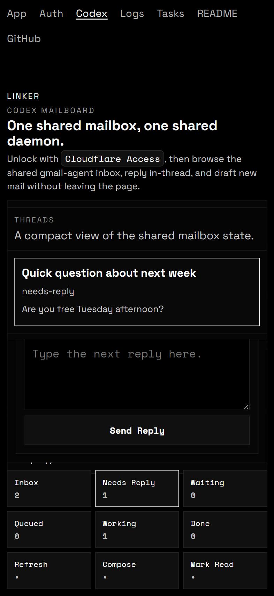

# Linker

Linker is a `luma.gl` + WebGPU DAG workplane viewer and editor with aligned `12x12x12` label grids, `rank/lane/depth` 3D navigation, a compact mobile-style menu-first control pad, an installable fullscreen PWA shell with a shared SVG icon and route manifest, a browser `/codex` Gmail inbox client that talks to the shared `gmail-agent` daemon on this computer by default, a `/new-user/` route for optional custom-host setup, and a browser `/logs` terminal page for timestamped history with source-line filters.

## 1. Live Onboarding

First-time GitHub Pages visits now boot from `demoPreset=dag-empty` and replace the top stats strip with an `onboard-panel`. The guided run starts on the bottom `Menu` pad and uses the same visible buttons and label input that Linker exposes to the user:

- open `Map`, `Stage`, `DAG`, `Edit`, and `View` from the menu-first `3x3` control hub
- stay in `3d-mode` first and title the root plus four connected workplanes with the shared input field
- build a readable five-node DAG from zero data with hotkeys: `C`, `[`, `]`, and `F`
- step through the discrete `graph-point`, `title-only`, `label-point`, and `full-workplane` LOD bands with `Shift+ArrowDown` and `Shift+ArrowUp`, starting from projected square node symbols and then revealing titles and local detail
- hand workplane selection off through smooth 2D and 3D camera motion instead of snapping between workplanes
- press `/` to enter `plane-focus`, then use `Arrow` keys, `Enter`, `Shift+Enter`, and `Escape` to add and link one local 2D label
- finish on the root-focused 3D DAG overview with the `Menu` pad reopened for manual exploration
- write one ordered screenshot per onboarding step into [`artifacts/test-screenshots/`](./artifacts/test-screenshots/) so the walkthrough can be reviewed visually step by step

Current proven invariant:

- `npm run test:browser` is green and now means the hosted-style onboarding proof
- `npm run test:browser:onboarding` stays green as the explicit onboarding alias
- `npm run test:browser:new-user` is green for the bring-your-own-host guide and local origin settings flow
- `npm run test:browser:logs` is green for the xterm.js `/logs/` history and filter route
- `npm run test:browser:codex` is green for the `/codex/` local-first mailboard connect, Gmail search, mailbox-view switching, inbox actions, reply, and compose screenshot proof
- `npm run test:browser:dag-network-build` is green for the canonical zero-data 2D + 3D interaction proof
- `npm run test:browser:suite` is green for the broader browser matrix around the onboarding-first product path
- `npm run test:dag:static` is green for pure DAG validation, layout, edge, and model mutation rules
- `npm run build:pages` is green for the deployable GitHub Pages bundle
- the shared site shell now advertises `site.webmanifest`, a monochrome SVG app icon, safe-area mobile meta tags, and a service worker-backed install surface
- the app canvas now renders the 2D and 3D DAG views in a black-and-white `Tron`-style presentation: black field, white highlights, grayscale text, projected square graph symbols, and bright curved DAG links
- workplane switches now animate through a camera handoff in both `plane-focus view` and the 3D DAG overview
- the default twelve-workplane DAG boot still uses the deterministic rank-slice autogrid, so each downstream rank reads as a visible `lane x depth` grid in 3D
- the onboarding proof now records `13` ordered screenshots, from `intro` through `complete`, in `artifacts/test-screenshots`
- `npm run test:browser -- --flow dag-zoom-journey` is green again for the five-workplane LOD ladder, including the square-symbol `graph-point` band

Replay and skip:

- the hosted root auto-runs onboarding on a true first visit
- `?onboarding=1` forces a replay
- `?onboarding=0` skips the intro and boots the regular DAG route
- after a completion or a skip, Linker stores a local completion flag and later hosted visits return to the normal DAG overview

Focused working loop:

```bash
npm run diagnose
npm run test:dag:static
npm run lint
npm run test:browser
npm run test:browser:logs
npm run test:browser:dag-network-build
npm run test:browser:dag-rank-fanout
npm run test:browser:suite
npm run build:pages
npm run test:live -- --url https://your-user.github.io/linker/ --expect-onboarding
```

`README.md` is now the repo-level source of truth for the live product path, the working loop, the domain language, the UI panels, and the current open review notes.

Current review queue:

- the zero-data `dag-network-build` flow remains the clearest end-to-end CRUD proof for local labels, local links, workplane creation, leaf delete, `rank/lane/depth`, and 2D/3D mode handoff
- the hosted onboarding screenshots under `artifacts/test-screenshots/` remain the visual contract for each guided step from empty root to the finished five-node DAG plus one stitched 2D local link
- direct 3D workplane picking plus explicit DAG edge create/remove between already-existing workplanes are still the main product gaps
- every publish should still end with a live pass over `/`, `/auth/`, `/codex/`, `/readme/`, and `/logs/`
- `/auth/` and `/codex/` on GitHub Pages should use `http://127.0.0.1:4192` on this computer by default when the shared `gmail-agent` daemon is running
- `/new-user/` is the optional privacy-safe route for replacing the default This Computer path with local browser-only custom-host settings

## 2. Screenshot and Links

<!-- README_SHOWCASE:START -->

<table>
  <tr>
    <td align="center"><a href="https://your-user.github.io/linker/"></a><br/><sub>Boot</sub></td>
    <td align="center"><a href="https://your-user.github.io/linker/?demoPreset=dag-rank-fanout&stageMode=3d-mode&workplane=wp-1&cameraLabel=wp-1%3A1%3A1%3A1"></a><br/><sub>DAG Build</sub></td>
    <td align="center"><a href="https://your-user.github.io/linker/?demoPreset=dag-rank-fanout&stageMode=3d-mode&workplane=wp-10&cameraLabel=wp-10%3A1%3A1%3A1"></a><br/><sub>Zoom Detail</sub></td>
    <td align="center"><a href="https://your-user.github.io/linker/codex/"></a><br/><sub>Codex</sub></td>
  </tr>
</table>

- Live root: [your-user.github.io/linker](https://your-user.github.io/linker/)
- GitHub repository: [github.com/your-org/linker](https://github.com/your-org/linker)

The live root now opens into the automated onboarding walkthrough on a first visit, then settles on the same DAG-first product path shown in the screenshots below.
<!-- README_SHOWCASE:END -->

Local dev URL: `http://127.0.0.1:5173/`

Docs routes:

- `/auth/`
- `/codex/`
- `/logs/`
- `/new-user/`
- `/readme/`

Install surface:

- `Menu -> Settings -> Install` shows the current install state and the install action when the browser makes it available
- the manifest entry is `/site.webmanifest`
- the shared icon assets are `/linker-icon.svg` and `/linker-icon-maskable.svg`

To choose the dataset and focused label on the live page, only change these query params:

```text
onboarding=0|1
demoPreset=classic|dag-empty|dag-rank-fanout|editor-lab
cameraLabel=workplane-id:layer:row:column
```

Example:

```text
https://your-user.github.io/linker/?demoPreset=dag-rank-fanout&cameraLabel=wp-10:1:1:1
```

`/new-user/` is now the optional custom-host page: leave Auth and Mail blank to use This Computer, or save private origins in local browser settings if you want a different Linker server.

`/auth/` and `/codex/` on GitHub Pages now default to This Computer. If the shared `gmail-agent` daemon is running on `http://127.0.0.1:4192`, the live site can use it directly from this machine. `/codex/` behaves like a compact Gmail inbox client with search, Inbox/Unread/Starred/Sent/All Mail/Codex views, thread-level read-star-archive controls, reply, and compose. For local development:

```bash
Copy-Item .env.codex.local.example .env.local
cd ..\\gmail-agent
npm run codex:daemon
cd ..\\linker
npm run dev -- --host 127.0.0.1
```

The Linker browser app now defaults to `http://127.0.0.1:4192` for `/auth/` and `/codex/` on this machine, including from the live GitHub Pages site. `gmail-agent` must answer the Private Network Access preflight for the current GitHub Pages origin, so the hosted page can reach the local loopback daemon from this browser.

To prove the shared mailbox sync from this repo itself, run:

```bash
npm run test:codex:mail-sync
```

That command checks the sibling `gmail-agent` auth state, starts the shared daemon if needed, calls the live `/api/mail/*` surface, and writes a proof artifact to `artifacts/codex-mail-sync-proof.json` when the local Gmail sync is healthy.

For a broader quick debug snapshot, run:

```bash
npm run diagnose
```

That command checks `gmail-agent` auth, whether the local codex daemon is running, `/api/mail/public-config`, `/api/mail/health`, inbox-thread fetch timing, and the live `App`, `Auth`, `Codex`, `Logs`, `New User`, and `README` routes. It writes the full report to `artifacts/system-diagnose.json`.

## 3. CLI Workflow

```bash
npm install --legacy-peer-deps

npm run dev -- --host 127.0.0.1
npm run diagnose
npm run lint
npm run build
npm run build:pages
npm run preview -- --host 127.0.0.1

cd ..\\gmail-agent
npm run codex:daemon
npm test
cd ..\\linker

npm run test:dag:static
npm run test:browser:boot
npm run test:browser:auth
npm run test:browser:codex
npm run test:browser:codex:live
npm run test:browser:dag-control-pad
npm run test:browser:dag-network-build
npm run test:browser:logs
npm run test:browser:new-user
npm run test:browser:onboarding
npm run test:browser:dag-rank-fanout
npm run test:browser:dag-rank-fanout:open
npm run test:browser:dag-zoom-journey
npm run test:browser -- --flow dag-view-smoke
npm run test:browser:readme
npm run test:browser:suite
npm run test:browser:onboarding
npm run test:codex:mail-sync
npm run test:browser
npm run test:preview
npm run test:live -- --url https://your-user.github.io/linker/
npm run test:live -- --url https://your-user.github.io/linker/ --expect-onboarding
npm run test:live -- --url https://your-user.github.io/linker/codex/
npm run test:live -- --url https://your-user.github.io/linker/ --allow-unsupported
npm test

npm run perf:trace -- --stage-mode 3d-mode --label-set benchmark --label-count 4096 --orbit-count 1
npm run perf:orbit-stutter -- --label-set benchmark --label-count 4096 --segment-count 3
```

## 4. Domain Language

- `label key`: the canonical id format `workplane-id:layer:row:column`, for example `wp-3:2:6:12`
- `workplane id`: the `wp-N` id for one workplane
- `layer`, `row`, `column`: the canonical navigation axes inside a workplane
- `grid cell`: one `row,column` slot on a workplane
- `label stack`: all authored layers for one grid cell
- `grid stack`: the full `12x12x12` lattice for one workplane
- `plane-stack`: the ordered multi-workplane document
- `active workplane`: the selected workplane in the `plane-stack`
- `plane-focus view`: the single-workplane `2d-mode`
- `stack view`: the multi-workplane `3d-mode`
- `bridge link`: a link between different workplanes
- `local link`: a link inside one workplane
- `editor cursor`: the current editable `workplane/layer/row/column`
- `ghost slot`: an empty adjacent grid cell shown as a creation target
- `ranked selection`: the ordered label selection used for link creation
- `workplane node`: one workplane treated as a DAG node in global `3d-mode`
- `rank`: the left-to-right dependency stage for a workplane node; the UX term for global DAG `column`
- `lane`: the top-to-bottom slot inside a rank; the UX term for global DAG `row`
- `depth`: the front-to-back slot inside a rank; the UX term for global DAG `layer`
- `rank slice`: the shared placement surface for all workplane nodes in one rank
- `rank-slice autogrid`: the deterministic downstream fill order that places new DAG children across a fixed `lane x depth` grid within one rank slice
- `child fanout`: the set of direct child workplanes spread across the next rank slice
- `autoplacement`: the deterministic rule that picks the next lane and depth slot for a newly created child within the downstream rank slice; the current default fills two depth rails before opening a new lane
- `DAG rails`: the snapped integer `rank/lane/depth` placement grid used in `3d-mode`
- `zoom band`: one discrete 3D DAG level of detail used by the `Zoom +` and `Zoom -` controls: `graph-point` (projected square node symbols), `title-only`, `label-points`, or `full-workplane`
- `menu pad`: the bottom 3x3 hub that routes the user into the other control pads
- `control pad section`: one named container inside the bottom pad: `menu`, `map`, `stage`, `dag`, `crud`, or `view`
- `map controls`: the user-facing name for the camera and cursor movement pad; the internal page key remains `navigate`
- `crud controls`: the user-facing name for the label typing and edit pad; the internal page key remains `edit`
- `view controls`: the user-facing name for the rendering-style pad for text and line strategies
- `status strip`: the compact live table at the top of the screen
- `onboard panel`: the guided walkthrough panel that temporarily replaces the status strip on first-run GitHub Pages visits
- `mailboard`: the `/codex/` mailbox UI backed by the shared `gmail-agent` daemon
- `mail view`: the currently selected mailbox filter on the `/codex/` bottom pad
- `mail search`: the `/codex/` mailbox query input used to filter the current mail view
- `thread row`: one visible mailbox summary in the `/codex/` list
- `label chip`: a small mailbox label badge shown on a thread row or message
- `thread action grid`: the `/codex/` detail-grid of Gmail controls like read, unread, star, and archive
- `message pane`: the selected thread detail area on `/codex/`
- `compose box`: the reply or new-mail text surface on `/codex/`
- `site menu`: the fullscreen top-right overlay shared by the app, docs, `/codex/`, `/new-user/`, and `/logs/`; it now has `Navigation` and `Settings` pages
- `embedded site menu`: the app-specific placement where the `Menu` toggle lives inside the top-right edge of the status strip or onboard panel instead of floating above the app
- `settings page`: the `site menu` page that now drills into `Layout`, `View`, `Motion`, and `Install`
- `ui layout`: the persisted shell density mode for the app route; current options are `Compact` and `Wide`
- `motion preference`: the persisted shell motion mode for the app route; current options are `Smooth` and `Reduced`
- `onboarding preference`: the persisted hosted-first onboarding mode; current options are `Auto` and `Skip`
- `install state`: the current PWA availability state surfaced inside `Menu -> Settings -> Install`

## 5. UI Panels

- `status strip`: the top telemetry table with the live stage stats and the embedded top-right `Menu` toggle
- `site menu`: the fullscreen top-right route picker with a breadcrumb header, `Navigation` and `Settings` pages, plus `App`, `New User`, `Auth`, `Codex`, `Logs`, `README`, and `GitHub` links
- `onboard panel`: the temporary top panel used during the automated first-run walkthrough; it replaces the stats body but keeps the embedded top-right `Menu` toggle in the same header
- `settings page`: the `site menu` page with nested `Layout`, `View`, `Motion`, and `Install` sections
- `install card`: the `site menu` install section that shows PWA availability, current display mode, and the install action
- `menu pad`: the default bottom 3x3 hub with one entry button for each main control pad: `Map`, `Stage`, `DAG`, `Edit`, and `View`, plus passive cue chips for `3D DAG`, `2D Plane`, `Title + Link`, and `Hotkeys`
- `map controls`: the bottom 3x3 container for zoom, orbit, and 2D cursor movement
- `stage controls`: the bottom 3x3 container for `2d-mode`, `3d-mode`, workplane switching, and root focus when a DAG is active
- `dag controls`: the bottom 3x3 container for `new child`, `new parent`, and `rank/lane/depth` DAG placement moves
- `edit controls`: the bottom input-grid container with one label input row plus two `3x3` action rows for selection, local linking, unlinking, removing, clearing, and returning to `Menu`
- `style controls`: the bottom 3x3 container for text and line rendering choices such as `Sharp`, `Soft`, `Step`, `Arc`, and `Orbit`
- `menu button`: the bottom-right button on the active pads that returns the user to the `Menu` hub
- `editor overlays`: the selection box, ranked-selection badges, and ghost-slot markers drawn over the canvas
- `mail meta cards`: the `/codex/` top status cards for mailbox, health, and current mail view
- `thread list`: the `/codex/` scrollable list of mailbox thread summaries
- `message pane`: the `/codex/` conversation view with message text, task history, and Gmail action grid
- `compose panel`: the `/codex/` new-mail form that opens inside the message pane
- `mail pad`: the `/codex/` bottom 3x3 pad for mailbox view switching plus `Refresh`, `Compose`, and `Clear`

## 6. Code Index

- `src/main.ts`: app entry point
- `src/docs-shell.ts`: shared fullscreen site menu with breadcrumb hierarchy, `Navigation` plus nested `Settings` sections, embedded/floating placements, install-state UI, and repo/link helpers used by the app and docs routes
- `src/remote-config.ts`: generic repo plus browser-side auth and mail origin resolution helpers, with This Computer as the default live-site target
- `src/pwa.ts`: shared PWA runtime for service worker registration, display-mode detection, and install-prompt state
- `src/auth-page.ts`: simple connection/status route that opens Codex on This Computer by default and falls back to saved custom hosts when present
- `src/new-user-page.ts`: minimal custom-host guide with private repo/auth/mail origin inputs stored in local browser settings
- `src/codex-page.ts`: `/codex/` route shell that mounts the mailboard UI inside the shared docs navigation
- `src/codex/CodexMailboardPage.ts`: codex route controller for local-daemon auto-connect, saved-host fallback, Gmail mailbox loading, search, view switching, inbox actions, reply, and compose
- `src/codex/CodexMailClient.ts`: browser client for the shared `gmail-agent` mail API with This Computer as the live-site default
- `src/codex/CodexMailboardView.ts`: mobile-first monochrome mailboard DOM, local-first connect state, Gmail search form, thread list, action grid, message pane, and bottom 3x3 mail pad
- `src/codex/codexMailboard.css`: `/codex/` mailboard layout and mobile-to-desktop route styling
- `src/logs-page.ts`: `/logs/` route shell that mounts the browser log terminal UI inside the shared docs navigation
- `src/logs/log-model.ts`: browser log entry types, source-line parsing, CLI command parsing, and filter helpers
- `src/logs/log-store.ts`: local browser log capture, console wrapping, localStorage history, and global store access
- `src/logs/LogsTerminalPage.ts`: logs route controller for filters, history, follow mode, and dataset exports
- `src/logs/LogsTerminalView.ts`: xterm.js-backed browser log terminal UI and command input handling
- `src/readme-page.ts`: live markdown preview route for `README.md`
- `src/app.ts`: WebGPU boot, plane-stack state, discrete DAG zoom-band stepping, input handling, render loop, and dataset exports
- `src/projector.ts`: plane-focus and stack-camera projection, including eased 3D orbit-target handoff between workplanes and tighter onboarding-first DAG framing
- `src/site-settings.ts`: persisted app settings storage for `UI Layout`, `Stage Mode`, `Text Style`, `Link Style`, `Motion`, and `Onboarding`
- `src/style.css`: static overlay grid for the status strip, embedded app menu header, fullscreen canvas, and bottom menu-first control pad
- `src/stage-chrome.ts`: DOM shell for the status strip, `onboard-panel`, embedded top-right menu slot, the monochrome `Menu` hub, the strict `CRUD` input-grid, and the `View` pad
- `src/stage-panels.ts`: sync logic for the `menu`, `map`, `stage`, `dag`, `crud`, and `view` control containers
- `src/stage-config.ts`: query parsing for `demoPreset`, `cameraLabel`, hosted onboarding, and persisted app-setting fallbacks
- `src/stage-session.ts`: boot hydration and default dataset selection
- `src/plane-stack.ts`: document/session helpers across workplanes, including DAG authoring, leaf delete, and rank-slice child autogrid placement
- `src/dag-document.ts`: DAG document types, validation helpers, and topological checks
- `src/dag-layout.ts`: integer DAG coordinate to world-space layout helpers for `rank/lane/depth` slices
- `src/dag-view.ts`: DAG-aware 3D scene assembly, shared LOD thresholds, projected square graph-point symbols, brighter monochrome overview rendering, and compatibility-mode stack rendering
- `src/stack-view.ts`: stacked 3D scene composition and bridge-link routing
- `src/stage-editor.ts`: cursor motion, ghost slots, ranked selection, and scene edits
- `src/stage-editor-overlay.ts`: DOM overlays for cursor, selection, and ghost slots
- `src/label-key.ts`: `workplane-id:layer:row:column` key builder and parser
- `src/data/labels.ts`: classic grid dataset builders
- `src/data/dag-rank-fanout.ts`: default twelve-workplane DAG dataset, now arranged as downstream rank-slice grids, plus layout fingerprint helpers
- `src/data/editor-lab.ts`: large editor demo dataset
- `src/data/network-dag.ts`: canonical five-workplane DAG fixture data used by the seeded smoke and static DAG checks
- `src/data/workplane-grid-stack.ts`: shared five-workplane `12x12x12` grid builder
- `src/data/links.ts`: canonical link builders
- `.env.codex.local.example`: local example env for pointing Linker at the shared `gmail-agent` mail API
- `src/text/layer.ts`: text visibility, glyph packing, and draw submission
- `src/line/layer.ts`: line visibility and draw submission
- `src/perf.ts`: CPU and GPU frame telemetry
- `scripts/test.ts`: browser test entry point
- `scripts/test/codex-page-smoke.ts`: focused `/codex/` browser route proof
- `scripts/test/logs-page-smoke.ts`: focused `/logs/` browser route proof for stored history, source filtering, and CLI follow mode
- `scripts/test/new-user-page-smoke.ts`: focused `/new-user/` browser route proof for local private-host setup
- `public/site.webmanifest`: installable PWA manifest for the hosted multi-route shell
- `public/sw.js`: service worker that caches the route shell for standalone launches
- `public/linker-icon.svg`: shared monochrome SVG app icon
- `public/linker-icon-maskable.svg`: padded maskable variant of the shared app icon
- `scripts/test/dag-control-pad.ts`: focused zero-data DAG authoring flow
- `scripts/test/dag-network-build.ts`: canonical zero-data end-to-end DAG interaction flow across 2D workplane CRUD and 3D DAG CRUD
- `scripts/test/onboarding-walkthrough.ts`: first-run hosted onboarding proof from an empty root to a five-node 3D DAG, one stitched 2D local-link edit, and one screenshot artifact per onboarding step
- `scripts/test/dag-rank-fanout.ts`: focused zero-data twelve-workplane rank-fanout authoring flow
- `scripts/test/dag-zoom-journey.ts`: screenshot-backed DAG zoom-band and 3D-to-2D return proof
- `scripts/test-dag-static.ts`: focused static DAG command entry point
- `scripts/test-preview.ts`: production-bundle smoke test
- `scripts/test-live.ts`: deployed-site smoke test
- `scripts/test/dag-view-smoke.ts`: focused browser DAG render smoke flow
- `scripts/test/`: browser helpers, smoke helpers, and step-based interaction coverage

