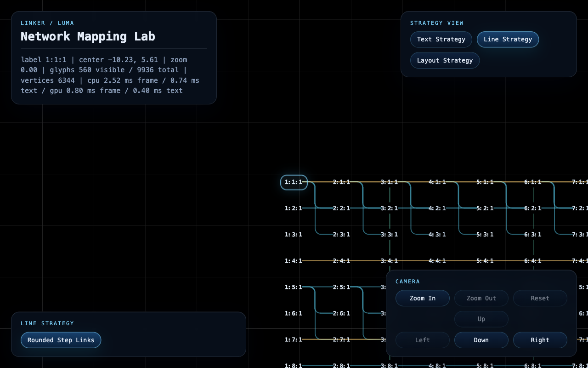

# Linker



Linker is a pure `luma.gl` + WebGPU repo for network mapping. It renders a deterministic demo
scene, uses `sdf-instanced` as the active production text path, exposes selectable line and layout
controls, and exports live runtime state through `document.body.dataset` so the browser tests and
the live app observe the same stage.

## CLI

Install dependencies:

```bash
npm install --legacy-peer-deps
```

Start the dev server:

```bash
npm run dev -- --host 127.0.0.1
```

Open:

```text
http://127.0.0.1:5173/
```

Useful commands:

```bash
npm run dev -- --host 127.0.0.1
npm run lint
npm run build
npm run preview
npm run test:browser
npm test
LINKER_EXTENDED_TEST_MATRIX=1 npm test
```

What they do:

- `npm run dev -- --host 127.0.0.1`: starts the local Vite dev server.
- `npm run test:browser`: runs the headed browser harness only.
- `npm test`: runs `eslint` and then the browser suite.
- `npm run build`: runs TypeScript and the production build.
- `LINKER_EXTENDED_TEST_MATRIX=1 npm test`: adds the extended demo sweep and benchmark matrix.

## URL Surface

Linker is route-driven. The fastest way to reproduce a scene is to keep a concrete URL.

Main query params:

- `textStrategy=sdf-instanced`: pin the production text path. Other text modes are not part of the
  active UI surface right now.
- `lineStrategy=...`: choose the active `line-strategy`.
- `layoutStrategy=...`: choose the demo layout strategy.
- `demoLayers=...`: choose the demo layer depth from `2` to `12`. The default route uses `12`.
- `cameraLabel=column:row:layer`: focus the demo camera on a specific label such as `1:1:1` or `3:4:2`.
- `cameraCenterX=...`, `cameraCenterY=...`, `cameraZoom=...`: seed the numeric camera path.
  This is mainly useful for benchmark routes or low-level camera debugging.
- `labelSet=benchmark`: switch from the canonical demo label-set to the benchmark label-set.
- `benchmark=1`: enable the benchmark route behavior.
- `labelCount=...`: choose the benchmark label count.
- `benchmarkFrames=...`: choose the benchmark trace length.
- `gpuTiming=0`: disable GPU timestamp collection.

Useful URLs:

- Demo scene:
  - `http://127.0.0.1:5173/`
- Demo with a specific `text-strategy`:
  - `http://127.0.0.1:5173/?textStrategy=sdf-instanced`
- Demo with the current line path:
  - `http://127.0.0.1:5173/?lineStrategy=rounded-step-links`
- Demo with the canonical layout:
  - `http://127.0.0.1:5173/?layoutStrategy=flow-columns`
- Compact two-layer demo:
  - `http://127.0.0.1:5173/?demoLayers=2`
- Demo focused on a specific label:
  - `http://127.0.0.1:5173/?cameraLabel=1:1:1`
  - `http://127.0.0.1:5173/?cameraLabel=3:4:2`
- Benchmark route:
  - `http://127.0.0.1:5173/?labelSet=benchmark&benchmark=1&textStrategy=sdf-instanced&labelCount=4096&benchmarkFrames=8`
- Benchmark route with GPU timing disabled:
  - `http://127.0.0.1:5173/?labelSet=benchmark&benchmark=1&gpuTiming=0`

Demo label ids use `column:row:layer`.

- `1:1:1` = first column, first row, root layer
- `1:1:2` = first column, first row, child layer

With the label-focused demo camera:

- `Right` and `Left` move across columns on the same row and layer.
- `Up` and `Down` move across rows on the same column and layer.
- `Zoom In` moves to the next layer in the same cell while one exists, for example
  `1:1:1 -> 1:1:2 -> 1:1:3`.
- At the deepest explicit layer, `Zoom In` keeps increasing numeric zoom so the camera can keep
  moving deeper without another authored label.
- `Zoom Out` first unwinds that extra numeric zoom, then moves to the previous layer in the same
  cell.

## Domain Language

Use these terms consistently:

- `luma-stage`: fullscreen runtime surface that owns the canvas, panels, overlays, and render loop
- `stage-canvas`: fullscreen WebGPU canvas behind the UI
- `text-layer`: atlas-backed label rendering layer
- `line-layer`: curved network-edge rendering layer
- `grid-layer`: background grid rendered behind text and links
- `label-set`: deterministic collection of labels used by the text-layer
- `link-set`: deterministic collection of network links used by the line-layer
- `text-strategy`: label-rendering path; the active product surface exposes `sdf-instanced`
- `line-strategy`: selectable network-edge path; the current project exposes `rounded-step-links`
- `network-mapping-strategy`: umbrella term for the selectable text and line strategy controls
- `demo layer-count`: authored number of zoomable label layers per cell, default `12`, min `2`, max `12`
- `zoom window`: authored reveal band defined by `zoomLevel` and `zoomRange`
- `link-point`: top-center, right-center, bottom-center, or left-center label anchor retained on each link
- `label-focused camera`: demo camera mode where the active camera target is always a label key
  like `2:3:1`, while numeric zoom can continue past the deepest explicit layer
- `camera-trace`: deterministic camera action sequence used by tests and benchmarks
- `frame-telemetry`: CPU, GPU, upload, visibility, and submission metrics for the current frame

## Scene Model

Default demo scene:

- label-set id: `scene-12x12x12-v1`
- layout strategy: `flow-columns`
- default `text-strategy`: `sdf-instanced`
- default `line-strategy`: `rounded-step-links`
- shape: `12 x 12 x 12` labels
- label format: `column:row:layer`
- layer `1` uses the root anchor
- layer `2` uses the child anchor
- layers `3+` reuse the child anchor and increase `zoomLevel` one step per layer

Compact demo scene:

- label-set id: `scene-12x12-v1`
- shape: `12 x 12 x 2` labels
- root labels use layer `1`
- child labels use layer `2`

Variable-depth demo scene:

- label-set id: `scene-12x12xN-v1`
- supported demo layer counts: `2` through `12`
- the camera can continue zooming deeper than the last explicit label layer

Benchmark scene:

- label-set id: `static-benchmark-label-set-v2`
- supported counts: `1024`, `4096`, `16384`
- the benchmark label-set is deterministic and should stay deterministic

## Code Map

Runtime shell:

- [`src/main.ts`](/Users/user/linker/src/main.ts): app entry point
- [`src/app.ts`](/Users/user/linker/src/app.ts): URL parsing, stage chrome, camera state, render loop, dataset exports
- [`src/style.css`](/Users/user/linker/src/style.css): fullscreen stage layout and UI styling

Camera and navigation:

- [`src/camera.ts`](/Users/user/linker/src/camera.ts): numeric 2D camera model and world/screen transforms
- [`src/label-navigation.ts`](/Users/user/linker/src/label-navigation.ts): demo label navigation index for left/right/up/down/zoom/reset behavior

Scene data:

- [`src/data/labels.ts`](/Users/user/linker/src/data/labels.ts): canonical demo label-set builder
- [`src/data/links.ts`](/Users/user/linker/src/data/links.ts): canonical demo link-set builder
- [`src/data/demo-layout.ts`](/Users/user/linker/src/data/demo-layout.ts): demo layout strategy and root/child placement
- [`src/data/static-benchmark.ts`](/Users/user/linker/src/data/static-benchmark.ts): deterministic benchmark label-set builder
- [`src/data/demo-meta.ts`](/Users/user/linker/src/data/demo-meta.ts): demo scene ids and metadata

Render layers:

- [`src/grid.ts`](/Users/user/linker/src/grid.ts): grid-layer rendering
- [`src/line/types.ts`](/Users/user/linker/src/line/types.ts): line strategy and link types
- [`src/line/curves.ts`](/Users/user/linker/src/line/curves.ts): line path sampling
- [`src/line/layer.ts`](/Users/user/linker/src/line/layer.ts): line-layer draw submission
- [`src/text/types.ts`](/Users/user/linker/src/text/types.ts): label, glyph, and active text-path types
- [`src/text/atlas.ts`](/Users/user/linker/src/text/atlas.ts): bitmap and SDF atlas generation
- [`src/text/charset.ts`](/Users/user/linker/src/text/charset.ts): character collection for atlas building
- [`src/text/layout.ts`](/Users/user/linker/src/text/layout.ts): glyph placement and label bounds
- [`src/text/zoom.ts`](/Users/user/linker/src/text/zoom.ts): shared label zoom-window math
- [`src/text/layer.ts`](/Users/user/linker/src/text/layer.ts): text-layer visibility analysis and SDF draw submission

Telemetry and tests:

- [`src/perf.ts`](/Users/user/linker/src/perf.ts): CPU and GPU frame telemetry
- [`scripts/run-test.ts`](/Users/user/linker/scripts/run-test.ts): top-level test runner
- [`scripts/test.ts`](/Users/user/linker/scripts/test.ts): browser test entry point
- [`scripts/test/`](/Users/user/linker/scripts/test): unit helpers, browser helpers, and step-based browser coverage

## How The Files Interact

The main runtime flow is:

1. [`src/main.ts`](/Users/user/linker/src/main.ts) creates the root node and starts the app.
2. [`src/app.ts`](/Users/user/linker/src/app.ts) reads the URL, builds the `luma-stage`, and creates:
   the `Camera2D`, `GridLayer`, `LineLayer`, and `TextLayer`.
3. For the demo route, [`src/data/labels.ts`](/Users/user/linker/src/data/labels.ts),
   [`src/data/links.ts`](/Users/user/linker/src/data/links.ts), and
   [`src/data/demo-layout.ts`](/Users/user/linker/src/data/demo-layout.ts) build the deterministic
   label-set and link-set.
4. [`src/label-navigation.ts`](/Users/user/linker/src/label-navigation.ts) maps label keys like
   `2:3:1` to neighbors so the demo camera can move by label instead of free pan.
5. [`src/text/layout.ts`](/Users/user/linker/src/text/layout.ts),
   [`src/text/atlas.ts`](/Users/user/linker/src/text/atlas.ts), and
   [`src/text/zoom.ts`](/Users/user/linker/src/text/zoom.ts) prepare glyph placement, atlas data,
   and continuous zoom/fade behavior for the `text-layer`.
6. [`src/text/layer.ts`](/Users/user/linker/src/text/layer.ts) and
   [`src/line/layer.ts`](/Users/user/linker/src/line/layer.ts) consume the current camera state
   every frame and submit visible text and links to WebGPU.
7. [`src/perf.ts`](/Users/user/linker/src/perf.ts) collects frame-telemetry, and
   [`src/app.ts`](/Users/user/linker/src/app.ts) writes the current app state to
   `document.body.dataset`.
8. The browser tests in [`scripts/test/`](/Users/user/linker/scripts/test) read those same dataset
   fields, click the real controls, and verify the live stage behavior.

## Testing Notes

- `npm test` writes `test.log`, `error.log`, and `browser.png`.
- `browser.png` captures the final browser state from the browser harness.
- The tests assert against `document.body.dataset`, not a private test-only state model.
