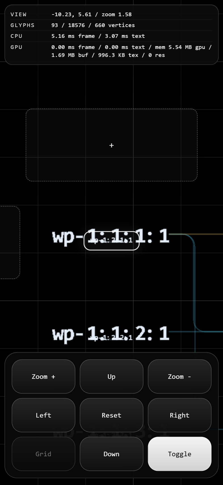
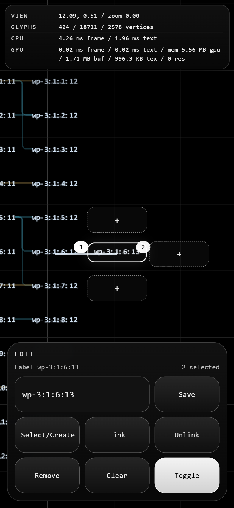
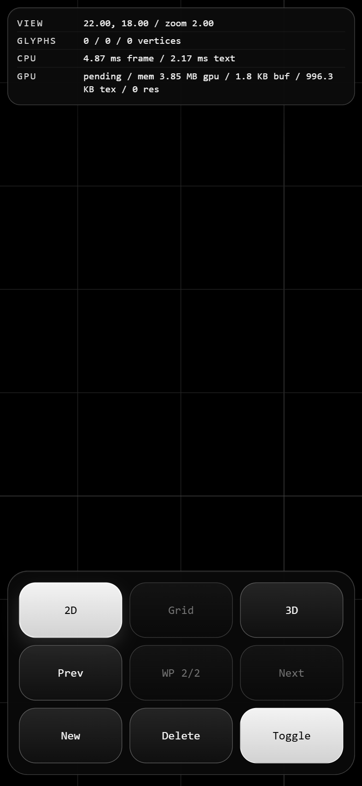
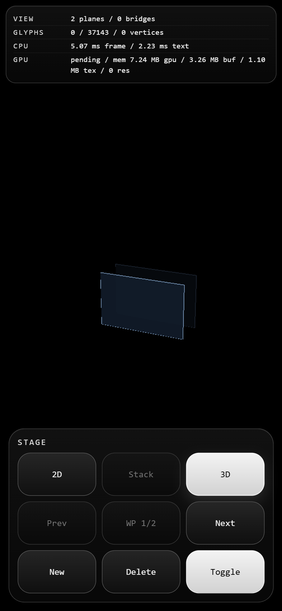
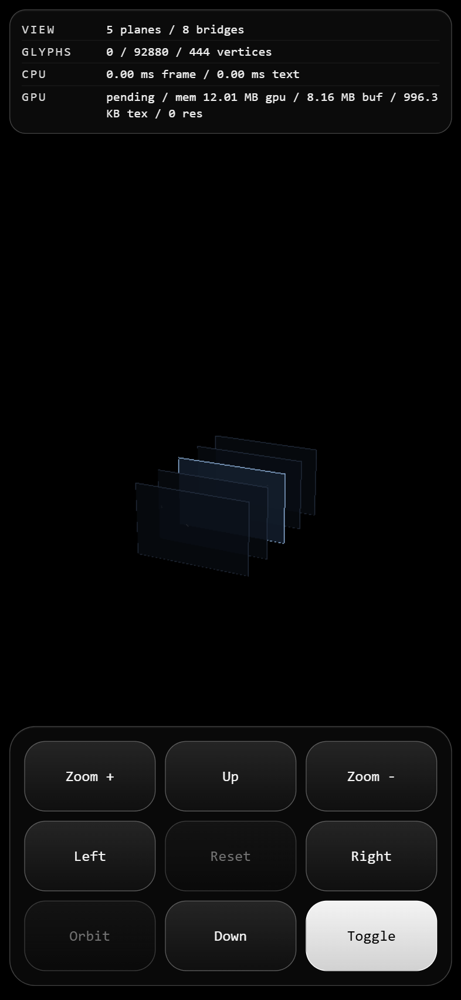

# Linker

Linker is a pure `luma.gl` + WebGPU repo for network mapping. It renders a deterministic demo
scene, uses `sdf-instanced` as the only production text path, supports a multi-workplane
`plane-stack` with `2d-mode` and `3d-mode`, keeps line and layout strategy switches route-driven, and
exports live runtime state through `document.body.dataset` so the browser tests and the live app
observe the same stage.

## 0. Screenshot and Links

<!-- README_SHOWCASE:START -->

<table>
  <tr>
    <td align="center"><a href="https://timcash.github.io/linker/"></a><br/><sub>Boot</sub></td>
    <td align="center"><a href="https://timcash.github.io/linker/?cameraLabel=wp-1%3A2%3A1%3A1&demoLayers=12&demoPreset=classic&labelSet=demo&stageMode=2d-mode&workplane=wp-1"></a><br/><sub>Zoom</sub></td>
    <td align="center"><a href="https://timcash.github.io/linker/?cameraLabel=wp-3%3A1%3A6%3A6&demoPreset=editor-lab&labelSet=demo&stageMode=2d-mode&workplane=wp-3"></a><br/><sub>Link</sub></td>
  </tr>
  <tr>
    <td align="center"><a href="https://timcash.github.io/linker/?cameraLabel=wp-3%3A1%3A6%3A6&demoPreset=editor-lab&labelSet=demo&stageMode=2d-mode&workplane=wp-3"></a><br/><sub>Spawn</sub></td>
    <td align="center"><a href="https://timcash.github.io/linker/?cameraLabel=wp-3%3A1%3A6%3A6&demoPreset=workplane-showcase&labelSet=demo&stageMode=3d-mode&workplane=wp-3"></a><br/><sub>Stack</sub></td>
    <td align="center"><a href="https://timcash.github.io/linker/?cameraLabel=wp-3%3A1%3A6%3A6&demoPreset=workplane-showcase&labelSet=demo&stageMode=3d-mode&workplane=wp-3"></a><br/><sub>Orbit</sub></td>
  </tr>
</table>

- Live root: [timcash.github.io/linker](https://timcash.github.io/linker/)
- Live classic 12x12x12: [Classic grid](https://timcash.github.io/linker/?cameraLabel=wp-1%3A1%3A1%3A1&demoLayers=12&demoPreset=classic&labelSet=demo&stageMode=2d-mode&workplane=wp-1)
- Live editor lab: [Editor lab](https://timcash.github.io/linker/?cameraLabel=wp-3%3A1%3A6%3A6&demoPreset=editor-lab&labelSet=demo&stageMode=2d-mode&workplane=wp-3)
- Live stack view: [Five-workplane showcase](https://timcash.github.io/linker/?cameraLabel=wp-3%3A1%3A6%3A6&demoPreset=workplane-showcase&labelSet=demo&stageMode=3d-mode&workplane=wp-3)
- GitHub repository: [github.com/timcash/linker](https://github.com/timcash/linker)

The browser test suite refreshes this gallery from the mobile interaction screenshots and keeps the links pointed at the live GitHub Pages routes.
<!-- README_SHOWCASE:END -->


- GitHub Pages owner site: [timcash.github.io](https://timcash.github.io/)
- Local dev URL: `http://127.0.0.1:5173/`

GitHub Pages deploys from the `main` branch through the repo workflow in `.github/workflows/deploy-pages.yml`.

## 1. Command Line Interface

Use `npm run <script> -- <flags>` whenever you need to forward flags into a Vite command or one of
the TypeScript perf tools.

```bash
npm install --legacy-peer-deps

npm run dev -- --host 127.0.0.1
npm run lint
npm run build
npm run build:pages
npm run preview -- --host 127.0.0.1
npm run test:browser
npm run test:preview
npm run test:live -- --url https://timcash.github.io/linker/
npm run test:live -- --url https://timcash.github.io/linker/ --allow-unsupported
npm test
LINKER_EXTENDED_TEST_MATRIX=1 npm test

npm run perf:trace -- --stage-mode 3d-mode --label-set benchmark --label-count 4096 --orbit-count 1
npm run perf:trace -- --stage-mode 2d-mode --label-set demo --sample-count 12

npm run perf:orbit-stutter -- --label-set benchmark --label-count 4096 --segment-count 3
npm run perf:orbit-stutter -- --label-set benchmark --label-count 4096 --trace 1 --profile 1
```

What they do:

- `npm install --legacy-peer-deps`: installs the pinned dependencies used by the app and test
  harness.
- `npm run dev -- --host 127.0.0.1`: starts the local Vite dev server.
- `npm run lint`: runs the ESLint configuration over the repo.
- `npm run build`: runs TypeScript and the production build.
- `npm run build:pages`: builds the GitHub Pages bundle with `/linker/` as the public base path.
- `npm run preview -- --host 127.0.0.1`: serves the production bundle locally.
- `npm run test:browser`: runs the headed browser harness only.
- `npm run test:preview`: builds the production bundle, serves it locally, and smoke-tests the bundled app.
- `npm run test:live -- --url ...`: smoke-tests the deployed site and fails on loading hangs, console errors, failed requests, or page errors.
- `npm run test:live -- --url ... --allow-unsupported`: accepts a clean `unsupported` result when the browser does not expose WebGPU, which is useful in CI.
- `npm test`: runs `eslint` and then the browser suite.
- `LINKER_EXTENDED_TEST_MATRIX=1 npm test`: adds the extended demo sweep and benchmark matrix.
- `npm run perf:trace -- ...`: records a control-by-control performance trace and prints a JSON
  report to stdout.
- `npm run perf:orbit-stutter -- ...`: runs the orbit-stutter regression harness and writes JSON,
  optional Chrome trace, and optional CPU profile artifacts to `artifacts/perf/`.

## URL Surface

Linker is route-driven. The fastest way to reproduce a scene is to keep a concrete URL.

Main query params:

- `lineStrategy=...`: choose the active `line-strategy`.
- `layoutStrategy=...`: choose the demo layout strategy.
- `demoPreset=classic|editor-lab|workplane-showcase`: choose the default demo document shape.
- `demoLayers=...`: choose the classic-demo layer depth from `2` to `12`. This only applies when
  `demoPreset=classic`.
- `cameraLabel=workplane-id:layer:row:column`: focus a specific label such as `wp-1:1:1:1` or
  `wp-3:4:6:12`.
- `cameraCenterX=...`, `cameraCenterY=...`, `cameraZoom=...`: seed the numeric camera path.
  This is mainly useful for benchmark routes or low-level camera debugging.
- `labelSet=benchmark`: switch from the canonical demo label-set to the benchmark label-set.
- `benchmark=1`: enable the benchmark route behavior.
- `labelCount=...`: choose the benchmark label count.
- `benchmarkFrames=...`: choose the benchmark trace length.
- `gpuTiming=0`: disable GPU timestamp collection.
- `session=stk-...`: restore a persisted local `plane-stack` session.
- `stageMode=3d-mode`: boot directly into `stack view`.
- `workplane=wp-N`: boot directly into a specific `active workplane` when it exists.

Legacy compatibility:

- `textStrategy=...` is accepted for older URLs, but the app always normalizes to `sdf-instanced`.

Useful URLs:

- Default route:
  - `http://127.0.0.1:5173/`
- Classic `12x12x12` scene:
  - `http://127.0.0.1:5173/?labelSet=demo&demoPreset=classic&demoLayers=12&stageMode=2d-mode&workplane=wp-1&cameraLabel=wp-1:1:1:1`
- Five-workplane editor lab:
  - `http://127.0.0.1:5173/?labelSet=demo&demoPreset=editor-lab&stageMode=2d-mode&workplane=wp-3&cameraLabel=wp-3:1:6:6`
- Five-workplane showcase in stack view:
  - `http://127.0.0.1:5173/?labelSet=demo&demoPreset=workplane-showcase&stageMode=3d-mode&workplane=wp-3&cameraLabel=wp-3:1:6:6`
- Demo with the current line path:
  - `http://127.0.0.1:5173/?lineStrategy=rounded-step-links`
- Demo with the canonical layout:
  - `http://127.0.0.1:5173/?layoutStrategy=flow-columns`
- Compact two-layer demo:
  - `http://127.0.0.1:5173/?demoLayers=2`
- Demo focused on a specific label:
  - `http://127.0.0.1:5173/?cameraLabel=wp-1:1:1:1`
  - `http://127.0.0.1:5173/?cameraLabel=wp-1:3:4:2`
- Demo in `stack view` on workplane 2:
  - `http://127.0.0.1:5173/?stageMode=3d-mode&workplane=wp-2&cameraLabel=wp-2:1:6:6`
- Benchmark route:
  - `http://127.0.0.1:5173/?labelSet=benchmark&benchmark=1&labelCount=4096&benchmarkFrames=8`
- Benchmark route with GPU timing disabled:
  - `http://127.0.0.1:5173/?labelSet=benchmark&benchmark=1&gpuTiming=0`

Demo label ids use `workplane-id:layer:row:column`.

- `wp-1:1:1:1` = workplane 1, layer 1, row 1, column 1
- `wp-1:2:1:1` = workplane 1, layer 2, row 1, column 1
- `wp-3:4:6:12` = workplane 3, layer 4, row 6, column 12

With the label-focused demo camera:

- `Right` and `Left` move across columns on the same row and layer.
- `Up` and `Down` move across rows on the same column and layer.
- `Zoom In` moves to the next layer in the same cell while one exists, for example
  `wp-1:1:1:1 -> wp-1:2:1:1 -> wp-1:3:1:1`.
- At the deepest explicit layer, `Zoom In` keeps increasing numeric zoom so the camera can keep
  moving deeper without another authored label.
- `Zoom Out` first unwinds that extra numeric zoom, then moves to the previous layer in the same
  cell.

## 2. Domain Language

Use these terms consistently across route params, scene builders, editor state, overlays, and test
fixtures:

- `label key`: the canonical id format `workplane-id:layer:row:column`, for example
  `wp-3:2:6:12`.
- `workplane id`: the `wp-N` identifier for a single plane in the document.
- `layer`, `row`, `column`: the canonical navigation axes inside a workplane. Keep this order when
  talking about label keys: `workplane-id:layer:row:column`.
- `grid cell`: one `row,column` slot on a workplane. Every layer in that cell shares the same
  `x,y` anchor.
- `label stack`: the full authored set of layers for one grid cell.
- `grid stack`: the full `12x12x12` aligned lattice for one workplane, or the repeated five-plane
  version used by the editor and showcase demos.
- `zoom step`: one deeper layer in a `label stack`. The authored step is `3x` per layer, encoded as
  a `zoomLevel` delta of `log2(3)`.
- `zoom window`: the visibility band for a label or link, defined by `zoomLevel` and `zoomRange`.
- `workplane`: one editable 2D scene with its own camera memory, label text overrides, local links,
  and editor state.
- `plane-stack`: the ordered multi-workplane document.
- `active workplane`: the selected workplane inside the `plane-stack`.
- `plane-focus view`: the single-workplane presentation used by `2d-mode`.
- `stack view`: the multi-workplane presentation used by `3d-mode`.
- `stack orbit camera`: the orbit camera used in `stack view`; it rotates around the active
  workplane while preserving the full multi-plane composition.
- `bridge link`: a link whose endpoints live on different workplanes. These links resolve and render
  in `stack view`.
- `local link`: a link whose endpoints live on the same workplane.
- `input link` / `output link`: the canonical directional endpoint names for persisted link data.
- `link-point`: one of `top-center`, `right-center`, `bottom-center`, or `left-center`.
- `editor cursor`: the current `workplane/layer/row/column` focus in label edit mode.
- `ghost slot`: an empty adjacent grid cell shown as a creation target around the cursor.
- `ranked selection`: the ordered selection chain built with `Enter`; `Shift+Enter` links it in
  rank order.
- `control pad page`: one page of the 3x3 bottom calculator pad. The current pages are
  `navigate`, `stage`, and `edit`.
- `status strip`: the compact top telemetry table.
- `frame telemetry`: CPU, GPU, upload, visibility, and submission stats captured per frame and
  mirrored into `document.body.dataset`.

Preferred naming rules:

- Use `workplaneId`, `layer`, `row`, and `column` for any persisted or route-facing label identity.
- Use `column`, `row`, and `layer` after layout and navigation. Reserve `sourceColumnIndex` and
  `sourceRowIndex` for pre-layout demo authoring only.
- Use `output*` and `input*` for shared link endpoint fields:
  `outputLabelKey`, `inputLabelKey`, `outputLocation`, `inputLocation`,
  `outputLinkPoint`, and `inputLinkPoint`.
- Avoid `source`, `target`, `start`, and `end` in exported app-level link models when they mean the
  same thing as `output` and `input`.
- Use `label-edit`, `editedLabelText`, `label-edit-panel`, `editor-cursor`, `ranked-selection`,
  and `ghost-slot` for editor-facing surfaces. Do not overload bare `input` for label-edit state.
- Treat `root` and `child` as legacy classic-demo vocabulary. For new work, prefer `label key`,
  `grid cell`, `label stack`, `layer`, `ghost slot`, `local link`, and `bridge link`.

## 3. Logs

The repo has two root-level test logs plus optional structured perf artifacts.

View them from a shell:

```bash
npm test
tail -n 40 test.log
tail -n 40 error.log

npm run perf:trace -- --stage-mode 3d-mode --label-set benchmark --label-count 4096 > perf-trace.json
npm run perf:orbit-stutter -- --label-set benchmark --label-count 4096 --trace 1 --profile 1
ls -1 artifacts/perf
```

Primary artifacts:

- `test.log`: combined runner, browser, and perf summary log written during `npm test` and
  `npm run test:browser`.
- `error.log`: failure-focused log. Browser-side errors are timestamped, while runner failures are
  recorded as escaped single-line entries.
- `browser.png`: screenshot artifact captured at the end of the browser harness.
- `artifacts/perf/*.summary.json`: structured summary written by `npm run perf:orbit-stutter`.
- `artifacts/perf/*.trace.json`: optional Chrome trace when `--trace 1` is enabled.
- `artifacts/perf/*.cpuprofile`: optional CPU profile when `--profile 1` is enabled.

Log format notes:

- Browser and harness lines use `[ISO-8601 timestamp] [kind] message`.
- Runner lines use prefixes such as `[runner]`, `[runner.error]`, and `[command.error]`.
- Multiline errors are newline-escaped as `\n` before they are appended to `error.log`.
- Intentional error pings tagged with `[intentional-error-ping]` are filtered out before the runner
  decides whether `error.log` contains unexpected failures.

Example `test.log` lines:

```text
[runner] npm run lint
[2026-04-05T22:17:54.220Z] [test] Starting browser test for http://127.0.0.1:4173/
[2026-04-05T22:18:01.004Z] [perf.report] [perf.pan] name=plane-focus-high-zoom stage=2d-mode planes=1 duration=812ms cpuFrame=4.281ms visibleLabels=144
Tests passed. See test.log for more details.
```

Example `error.log` lines:

```text
[2026-04-05T22:18:03.901Z] [response.error] 404 http://127.0.0.1:4173/missing.png
[runner.error] Command failed with exit code 1: npm run test:browser
[command.error] npm run test:browser exited with code 1\nError: error.log contains unexpected entries. See error.log for details.
```

## Scene Model

Classic demo scene:

- label-set id: `scene-12x12x12-v1`
- layout strategy: `flow-columns`
- default `text-strategy`: `sdf-instanced`
- default `line-strategy`: `rounded-step-links`
- shape: `12 x 12 x 12` labels
- label format: `workplane-id:layer:row:column`
- each label tracks its `inputLinkKeys` and `outputLinkKeys`
- every layer in a cell reuses the same grid anchor
- layer `2` is the first deeper zoom step for that cell
- each deeper layer advances by the shared `3x` zoom step (`log2(3)` in `zoomLevel`)

Compact classic scene:

- label-set id: `scene-12x12-v1`
- shape: `12 x 12 x 2` labels
- the compact stack still uses `workplane-id:layer:row:column`
- layer `1` is the surface layer
- layer `2` is the first deeper zoom layer

Variable-depth demo scene:

- label-set id: `scene-12x12xN-v1`
- supported demo layer counts: `2` through `12`
- the camera can continue zooming deeper than the last explicit label layer

Benchmark scene:

- label-set id: `static-benchmark-label-set-v2`
- supported counts: `1024`, `4096`, `16384`
- the benchmark label-set is deterministic and should stay deterministic

## Code Map

Runtime shell:

- [`src/main.ts`](/Users/user/linker/src/main.ts): app entry point
- [`src/app.ts`](/Users/user/linker/src/app.ts): URL parsing, plane-stack control flow, camera state, render loop, dataset exports
- [`src/style.css`](/Users/user/linker/src/style.css): fullscreen stage layout and UI styling

Camera and navigation:

- [`src/camera.ts`](/Users/user/linker/src/camera.ts): numeric 2D camera model and world/screen transforms
- [`src/label-navigation.ts`](/Users/user/linker/src/label-navigation.ts): demo label navigation index for left/right/up/down/zoom/reset behavior
- [`src/projector.ts`](/Users/user/linker/src/projector.ts): `plane-focus view` and `stack view` projection contracts
- [`src/plane-stack.ts`](/Users/user/linker/src/plane-stack.ts): `plane-stack` document/session state helpers
- [`src/stack-view.ts`](/Users/user/linker/src/stack-view.ts): derived `stack view` scene composition
- [`src/stage-session.ts`](/Users/user/linker/src/stage-session.ts): plane-stack hydration rules
- [`src/stage-editor.ts`](/Users/user/linker/src/stage-editor.ts): grid-cell cursor, ghost-slot, selection-rank, and scene-edit helpers
- [`src/stage-editor-overlay.ts`](/Users/user/linker/src/stage-editor-overlay.ts): overlay sync for the editor cursor, ghost slots, and rank badges

Scene data:

- [`src/data/labels.ts`](/Users/user/linker/src/data/labels.ts): canonical demo label-set builder
- [`src/data/links.ts`](/Users/user/linker/src/data/links.ts): canonical demo link-set builder
- [`src/data/demo-layout.ts`](/Users/user/linker/src/data/demo-layout.ts): demo layout strategy and root/child placement
- [`src/data/static-benchmark.ts`](/Users/user/linker/src/data/static-benchmark.ts): deterministic benchmark label-set builder
- [`src/data/demo-meta.ts`](/Users/user/linker/src/data/demo-meta.ts): demo scene ids and metadata

Render layers:

- [`src/grid.ts`](/Users/user/linker/src/grid.ts): grid-layer rendering
- [`src/line/types.ts`](/Users/user/linker/src/line/types.ts): line strategy and link types
- [`src/line/curves.ts`](/Users/user/linker/src/line/curves.ts): line path sampling
- [`src/line/layer.ts`](/Users/user/linker/src/line/layer.ts): line-layer draw submission
- [`src/stack-backplate.ts`](/Users/user/linker/src/stack-backplate.ts): `stack view` workplane backplate rendering
- [`src/text/types.ts`](/Users/user/linker/src/text/types.ts): label, glyph, and active text-path types
- [`src/text/atlas.ts`](/Users/user/linker/src/text/atlas.ts): bitmap and SDF atlas generation
- [`src/text/charset.ts`](/Users/user/linker/src/text/charset.ts): character collection for atlas building
- [`src/text/layout.ts`](/Users/user/linker/src/text/layout.ts): glyph placement and label bounds
- [`src/text/zoom.ts`](/Users/user/linker/src/text/zoom.ts): shared label zoom-window math
- [`src/text/layer.ts`](/Users/user/linker/src/text/layer.ts): text-layer visibility analysis and SDF draw submission

Telemetry and tests:

- [`src/perf.ts`](/Users/user/linker/src/perf.ts): CPU and GPU frame telemetry
- [`scripts/run-test.ts`](/Users/user/linker/scripts/run-test.ts): top-level test runner
- [`scripts/test.ts`](/Users/user/linker/scripts/test.ts): browser test entry point
- [`scripts/test/`](/Users/user/linker/scripts/test): unit helpers, browser helpers, and step-based browser coverage

## How The Files Interact

The main runtime flow is:

1. [`src/main.ts`](/Users/user/linker/src/main.ts) creates the root node and starts the app.
2. [`src/app.ts`](/Users/user/linker/src/app.ts) reads the URL, builds the `luma-stage`, hydrates the
   `plane-stack`, and creates the `Camera2D`, `GridLayer`, `LineLayer`, `TextLayer`, and stack-view
   backplate layer.
3. For the demo route, [`src/data/labels.ts`](/Users/user/linker/src/data/labels.ts),
   [`src/data/links.ts`](/Users/user/linker/src/data/links.ts), and
   [`src/data/demo-layout.ts`](/Users/user/linker/src/data/demo-layout.ts) build the deterministic
   label-set and link-set.
4. [`src/label-navigation.ts`](/Users/user/linker/src/label-navigation.ts) maps label keys like
   `wp-1:2:3:1` to neighbors so the demo camera can move by label instead of free pan.
5. [`src/text/layout.ts`](/Users/user/linker/src/text/layout.ts),
   [`src/text/atlas.ts`](/Users/user/linker/src/text/atlas.ts), and
   [`src/text/zoom.ts`](/Users/user/linker/src/text/zoom.ts) prepare glyph placement, atlas data,
   and continuous zoom/fade behavior for the `text-layer`.
6. [`src/text/layer.ts`](/Users/user/linker/src/text/layer.ts) and
   [`src/line/layer.ts`](/Users/user/linker/src/line/layer.ts) consume the current camera state
   every frame and submit visible text and links to WebGPU.
7. [`src/perf.ts`](/Users/user/linker/src/perf.ts) collects frame-telemetry, and
   [`src/app.ts`](/Users/user/linker/src/app.ts) writes the current app state to
   `document.body.dataset`.
8. The browser tests in [`scripts/test/`](/Users/user/linker/scripts/test) read those same dataset
   fields, click the real controls, and verify the live stage behavior.

