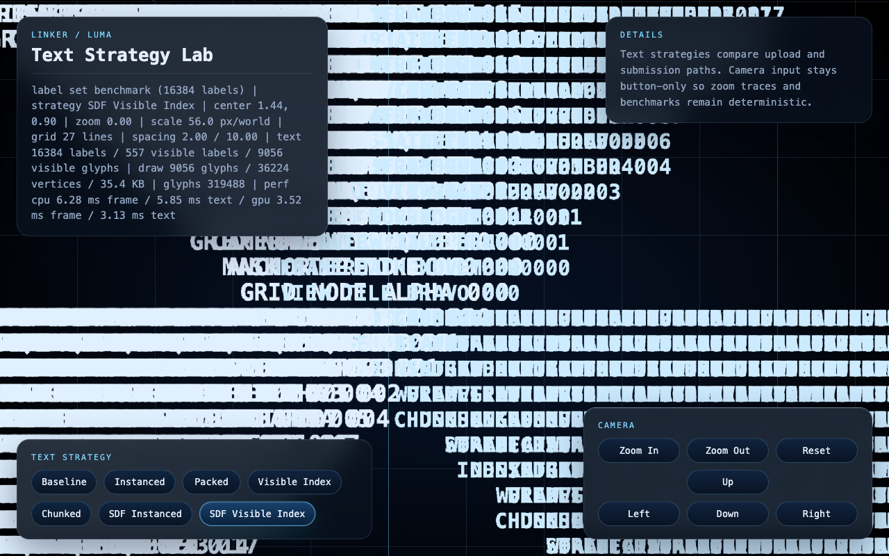

# Linker



Linker is a pure `luma.gl` + WebGPU text strategy lab.

The system is easiest to reason about as:

- one fullscreen `luma-stage`
- one `stage-canvas`
- one `grid-layer`
- one `text-layer`
- several explicit `text-strategy` paths
- deterministic `label-set` inputs
- deterministic `camera-trace` tests
- measurable `frame-telemetry`

## Domain Language

Use these words consistently when describing the system:

- `luma-stage`
  The fullscreen runtime surface that owns the canvas, panels, and render loop.
- `stage-canvas`
  The fullscreen WebGPU canvas behind the UI.
- `text-layer`
  The atlas-backed label rendering layer.
- `text-strategy`
  A selectable text rendering path such as `baseline` or `chunked`.
- `label-set`
  A deterministic collection of labels used by the text layer.
- `camera-trace`
  A deterministic zoom and pan script used by tests and benchmarks.
- `frame-telemetry`
  CPU, GPU, upload, visibility, and submission metrics for the current frame or benchmark run.

Canonical public surface:

- use `labelSet=...` to choose the label-set
- use `textStrategy=...` to choose the text strategy
- use `cameraCenterX=...`, `cameraCenterY=...`, and `cameraZoom=...` to seed or share the camera view
- read live label, strategy, and benchmark telemetry from `document.body.dataset`

## Quick Start

Install dependencies:

```bash
npm install --legacy-peer-deps
```

Start the dev server:

```bash
npm run dev -- --host 127.0.0.1
```

Open:

`http://127.0.0.1:5173/`

Useful routes:

- Demo route: `/`
- Start in a specific text strategy: `/?textStrategy=chunked`
- Start at a specific camera view: `/?cameraCenterX=1.25&cameraCenterY=-2.5&cameraZoom=0.75`
- Run a benchmark route: `/?labelSet=benchmark&benchmark=1&textStrategy=sdf-visible-index&labelCount=4096&benchmarkFrames=8`
- Disable GPU timing explicitly: `/?gpuTiming=0`

The default UI boots the demo label-set preset `demo-label-set-v1`, which is sourced from `src/data/demo-label-set.csv`.

## Deterministic Assets

- Demo label-set id: `demo-label-set-v1`
- Demo label-set source: `src/data/demo-label-set.csv`
- Demo label-set layout: `12` left-to-right columns with `1..12` top-level roots
- Demo hierarchy depth: every top-level root generates `2` nested zoom-in levels
- Benchmark label-set id: `static-benchmark-label-set-v2`
- Benchmark label counts: `1024`, `4096`, `16384`
- Benchmark route template:

```text
/?labelSet=benchmark&benchmark=1&textStrategy=<baseline|instanced|packed|visible-index|chunked|sdf-instanced|sdf-visible-index>&labelCount=<1024|4096|16384>&benchmarkFrames=8
```

Never replace the benchmark label set with random or unstable generation.

## Terminal Commands

- `npm run dev -- --host 127.0.0.1`
  Starts Vite on `127.0.0.1:5173`.
- `npm run lint`
  Runs ESLint across the repo.
- `npm run build`
  Runs TypeScript and produces the Vite production build.
- `npm run preview`
  Serves the production build locally.
- `npm test`
  Runs `lint` first, then launches the headed Chrome WebGPU test suite.

## UI Panels

The page uses a fullscreen CSS grid with the `stage-canvas` filling the viewport behind the UI.

- `status-panel`
  Top-left. Shows live app state, camera state, grid counts, visible label counts, upload size, and current frame telemetry.
- `details-panel`
  Top-right. Holds the current operator-facing explanation of what the stage is testing.
- `render-panel`
  Bottom-left. Contains the text strategy buttons used to switch the active text path.
- `camera-panel`
  Bottom-right. Contains the deterministic pan, zoom, and reset button grid.
- `stage-canvas`
  Fullscreen WebGPU canvas rendered behind all panels.

Current panel layout:

- top-left = `status-panel`
- top-right = `details-panel`
- bottom-left = `render-panel`
- bottom-right = `camera-panel`

## Render Strategies

- `baseline`
  Correctness reference. CPU filters visible glyphs and expands them into full triangle-list vertex data every frame.
- `instanced`
  CPU still filters visible glyphs, but uploads visible glyph instances instead of expanded triangles.
- `packed`
  Uploads packed glyph records once and only updates camera uniforms, but still submits the full packed glyph set every frame.
- `visible-index`
  Uploads glyph records once, then uploads only the current visible glyph index list for drawing.
- `chunked`
  Uses the visible-index draw path plus a `chunk-index` to reduce CPU visibility work.
- `sdf-instanced`
  Reuses the instanced quad path, but samples an SDF atlas for smoother text edges inspired by `deck.gl` and `MapLibre`.
- `sdf-visible-index`
  Combines the indexed visible-glyph submission path with the SDF atlas for the current best smooth-text indexed path.

Practical guidance:

- use `baseline` when checking correctness first
- use `instanced` as the simple improvement over baseline uploads
- use `visible-index` when comparing indexed submission behavior
- use `chunked` when testing the current best CPU-side visibility path
- use `sdf-instanced` when you want the instanced path with smoother SDF text shading
- use `sdf-visible-index` when you want indexed submission plus smoother SDF text shading
- use `packed` when isolating the cost of near-zero per-frame upload with full-set submission

## Testing

The repo is intentionally test-heavy for a rendering prototype. `npm test` starts its own Vite server on `127.0.0.1:4173`, launches headed Chrome with WebGPU enabled, and exercises the live stage through deterministic camera traces.

What the test suite checks:

- app boot reaches `ready` without unexpected browser errors
- the `stage-canvas` fills the viewport
- the four UI panels are present and positioned correctly
- the default demo route uses the shared preset `demo-label-set-v1`
- all render-panel buttons switch strategies correctly
- zoom-band visibility behaves correctly for every text strategy
- each strategy survives a large-scale `4096` label zoom sweep with visible and fully hidden phases
- benchmark routes use the shared preset `static-benchmark-label-set-v2`
- benchmark summaries are collected for `1024`, `4096`, and `16384` labels
- `browser.log` and `browser.png` are written on each run

Benchmark route template:

```text
/?labelSet=benchmark&benchmark=1&textStrategy=<baseline|instanced|packed|visible-index|chunked|sdf-instanced|sdf-visible-index>&labelCount=<1024|4096|16384>&benchmarkFrames=8
```

The benchmark label set is deterministic. All strategies run against stable prefixes of the same centered static label set, so the comparisons are meaningful.

GPU timing note:

- GPU timing is enabled by default. Use `gpuTiming=0` to disable it for a route.
- When timestamp-query is supported, the app records both total GPU frame time and a text-only GPU pass time so text strategies can be compared more directly.
- the total GPU frame metric is derived from the timed render passes, so it excludes small untimed command overhead between passes.
- Chrome quantizes timestamp queries to `100` microseconds by default. For higher-resolution development measurements, enable `chrome://flags/#enable-webgpu-developer-features`.

## Contributor Workflow

Use this when making non-trivial changes:

1. Name the task in domain terms.
2. Pick one primary owner: stage, camera model, grid layer, text layer, or frame telemetry.
3. Trace the control path before editing.
   For text work: `readStageConfig -> LumaStageController.start -> TextLayer.createStrategy -> TextLayer.update -> TextLayer.draw -> LumaStageController.updateStatus`.
4. Keep the benchmark label set and camera trace deterministic.
5. Export any comparison-worthy metric through `document.body.dataset`.
6. Extend the browser suite with structural assertions instead of fragile hardcoded thresholds.
7. Keep panel names semantic: `status-panel`, `details-panel`, `render-panel`, `camera-panel`.
8. Run the quality gate before handing work back.

Quality gate:

- `npm run lint`
- `npm run build`
- `npm test`

## Text CSV File Example

The demo label set is sourced from `src/data/demo-label-set.csv`.

The file format is intentionally simple: one text item per line.

```csv
WORLD VIEW
BUTTON PAN
STATUS PANEL
DETAILS PANEL
RENDER PANEL
CAMERA PANEL
STAGE CANVAS
GRID LAYER
TEXT LAYER
FRAME TELEMETRY
GPU SAMPLE
CPU SAMPLE
```

Notes:

- empty lines are ignored
- wrapping single or double quotes are stripped
- each CSV row becomes a top-level root label in the demo hierarchy
- the demo layout fills `12` left-to-right columns with `1..12` roots per column
- every top-level root automatically gets `2` nested zoom-in labels
- if the CSV has fewer than `78` root rows, fallback labels are used
- if the CSV has more than `78` root rows, extra rows are ignored

The parsing and placement logic lives in `src/data/labels.ts`.

## luma.gl Quick Start

If you are new to this repo, start with these files:

- `src/app.ts`
  Boots the `luma-stage`, reads query params, builds the panels, runs the render loop, and exports stage telemetry.
- `src/camera.ts`
  Owns the 2D camera model and world-to-screen transforms.
- `src/grid.ts`
  Implements the `grid-layer`.
- `src/text/layer.ts`
  Implements the `text-layer`, text strategy selection, visibility analysis, and draw submission.
- `src/perf.ts`
  Captures CPU and GPU frame telemetry.

Minimal render flow:

1. `startApp` creates the stage chrome and reads the route config.
   Current stage helpers: `createStageChrome`, `readStageConfig`, and `LumaStageController`.
2. `luma.createDevice(...)` creates the WebGPU device and binds the `stage-canvas`.
3. `GridLayer` and `TextLayer` are created from the chosen `label-set` and `text-strategy`.
4. Each frame updates camera-dependent grid and text state.
5. A render pass draws the background, grid layer, and text layer.
6. The device submits the frame and `FrameTelemetry` updates `frame-telemetry`.

If you want to add another text strategy, the shortest path is:

1. Add the mode to `src/text/types.ts`.
2. Implement the strategy path in `src/text/layer.ts`.
3. Expose the new button in the render panel from `src/app.ts`.
4. Extend `scripts/test.ts` so the new strategy participates in zoom sweeps and benchmark collection.

## Performance History

### 2026-03-25T22:40:26.417Z

```text
strategy=baseline labels=1024 glyphs=19968 cpuFrame=3.883ms cpuSamples=12 cpuText=3.450ms cpuDraw=0.317ms gpu=2.802ms gpuSamples=12 gpuText=2.375ms uploaded=1472832B visibleLabels=402 visibleGlyphs=7671 visibleVertices=46026 submittedGlyphs=7671 submittedVertices=46026 visibleChunks=0 labelSetPreset=static-benchmark-label-set-v2
strategy=instanced labels=1024 glyphs=19968 cpuFrame=1.842ms cpuSamples=12 cpuText=1.442ms cpuDraw=0.325ms gpu=3.156ms gpuSamples=12 gpuText=2.690ms uploaded=368224B visibleLabels=402 visibleGlyphs=7671 visibleVertices=30684 submittedGlyphs=7671 submittedVertices=30684 visibleChunks=0 labelSetPreset=static-benchmark-label-set-v2
strategy=packed labels=1024 glyphs=19968 cpuFrame=1.125ms cpuSamples=12 cpuText=0.717ms cpuDraw=0.300ms gpu=2.921ms gpuSamples=12 gpuText=2.468ms uploaded=32B visibleLabels=402 visibleGlyphs=7671 visibleVertices=30684 submittedGlyphs=19968 submittedVertices=79872 visibleChunks=0 labelSetPreset=static-benchmark-label-set-v2
strategy=visible-index labels=1024 glyphs=19968 cpuFrame=1.200ms cpuSamples=12 cpuText=0.783ms cpuDraw=0.283ms gpu=2.740ms gpuSamples=12 gpuText=2.296ms uploaded=30716B visibleLabels=402 visibleGlyphs=7671 visibleVertices=30684 submittedGlyphs=7671 submittedVertices=30684 visibleChunks=0 labelSetPreset=static-benchmark-label-set-v2
strategy=chunked labels=1024 glyphs=19968 cpuFrame=1.158ms cpuSamples=12 cpuText=0.792ms cpuDraw=0.275ms gpu=2.444ms gpuSamples=12 gpuText=2.003ms uploaded=30716B visibleLabels=402 visibleGlyphs=7671 visibleVertices=30684 submittedGlyphs=7671 submittedVertices=30684 visibleChunks=12 labelSetPreset=static-benchmark-label-set-v2
strategy=sdf-instanced labels=1024 glyphs=19968 cpuFrame=1.775ms cpuSamples=12 cpuText=1.342ms cpuDraw=0.317ms gpu=2.846ms gpuSamples=12 gpuText=2.375ms uploaded=368240B visibleLabels=402 visibleGlyphs=7671 visibleVertices=30684 submittedGlyphs=7671 submittedVertices=30684 visibleChunks=0 labelSetPreset=static-benchmark-label-set-v2
strategy=sdf-visible-index labels=1024 glyphs=19968 cpuFrame=1.200ms cpuSamples=12 cpuText=0.767ms cpuDraw=0.300ms gpu=2.789ms gpuSamples=12 gpuText=2.310ms uploaded=30732B visibleLabels=402 visibleGlyphs=7671 visibleVertices=30684 submittedGlyphs=7671 submittedVertices=30684 visibleChunks=0 labelSetPreset=static-benchmark-label-set-v2
strategy=baseline labels=4096 glyphs=79872 cpuFrame=6.708ms cpuSamples=12 cpuText=6.283ms cpuDraw=0.300ms gpu=3.287ms gpuSamples=12 gpuText=2.809ms uploaded=1758336B visibleLabels=595 visibleGlyphs=9158 visibleVertices=54948 submittedGlyphs=9158 submittedVertices=54948 visibleChunks=0 labelSetPreset=static-benchmark-label-set-v2
strategy=instanced labels=4096 glyphs=79872 cpuFrame=3.183ms cpuSamples=12 cpuText=2.817ms cpuDraw=0.275ms gpu=3.432ms gpuSamples=12 gpuText=3.014ms uploaded=439600B visibleLabels=595 visibleGlyphs=9158 visibleVertices=36632 submittedGlyphs=9158 submittedVertices=36632 visibleChunks=0 labelSetPreset=static-benchmark-label-set-v2
strategy=packed labels=4096 glyphs=79872 cpuFrame=2.358ms cpuSamples=12 cpuText=1.917ms cpuDraw=0.333ms gpu=3.470ms gpuSamples=12 gpuText=2.984ms uploaded=32B visibleLabels=595 visibleGlyphs=9158 visibleVertices=36632 submittedGlyphs=79872 submittedVertices=319488 visibleChunks=0 labelSetPreset=static-benchmark-label-set-v2
strategy=visible-index labels=4096 glyphs=79872 cpuFrame=2.042ms cpuSamples=12 cpuText=1.658ms cpuDraw=0.300ms gpu=3.044ms gpuSamples=13 gpuText=2.576ms uploaded=36664B visibleLabels=595 visibleGlyphs=9158 visibleVertices=36632 submittedGlyphs=9158 submittedVertices=36632 visibleChunks=0 labelSetPreset=static-benchmark-label-set-v2
strategy=chunked labels=4096 glyphs=79872 cpuFrame=1.883ms cpuSamples=12 cpuText=1.508ms cpuDraw=0.283ms gpu=3.170ms gpuSamples=12 gpuText=2.740ms uploaded=36664B visibleLabels=595 visibleGlyphs=9158 visibleVertices=36632 submittedGlyphs=9158 submittedVertices=36632 visibleChunks=18 labelSetPreset=static-benchmark-label-set-v2
strategy=sdf-instanced labels=4096 glyphs=79872 cpuFrame=2.583ms cpuSamples=12 cpuText=2.208ms cpuDraw=0.267ms gpu=3.549ms gpuSamples=12 gpuText=3.127ms uploaded=439616B visibleLabels=595 visibleGlyphs=9158 visibleVertices=36632 submittedGlyphs=9158 submittedVertices=36632 visibleChunks=0 labelSetPreset=static-benchmark-label-set-v2
strategy=sdf-visible-index labels=4096 glyphs=79872 cpuFrame=1.867ms cpuSamples=12 cpuText=1.408ms cpuDraw=0.342ms gpu=3.360ms gpuSamples=13 gpuText=2.914ms uploaded=36680B visibleLabels=595 visibleGlyphs=9158 visibleVertices=36632 submittedGlyphs=9158 submittedVertices=36632 visibleChunks=0 labelSetPreset=static-benchmark-label-set-v2
strategy=baseline labels=16384 glyphs=319488 cpuFrame=8.375ms cpuSamples=12 cpuText=7.975ms cpuDraw=0.300ms gpu=4.284ms gpuSamples=12 gpuText=3.868ms uploaded=1758336B visibleLabels=595 visibleGlyphs=9158 visibleVertices=54948 submittedGlyphs=9158 submittedVertices=54948 visibleChunks=0 labelSetPreset=static-benchmark-label-set-v2
strategy=instanced labels=16384 glyphs=319488 cpuFrame=7.015ms cpuSamples=13 cpuText=6.531ms cpuDraw=0.377ms gpu=3.238ms gpuSamples=12 gpuText=2.780ms uploaded=439600B visibleLabels=595 visibleGlyphs=9158 visibleVertices=36632 submittedGlyphs=9158 submittedVertices=36632 visibleChunks=0 labelSetPreset=static-benchmark-label-set-v2
strategy=packed labels=16384 glyphs=319488 cpuFrame=4.175ms cpuSamples=12 cpuText=3.750ms cpuDraw=0.300ms gpu=4.256ms gpuSamples=12 gpuText=3.865ms uploaded=32B visibleLabels=595 visibleGlyphs=9158 visibleVertices=36632 submittedGlyphs=319488 submittedVertices=1277952 visibleChunks=0 labelSetPreset=static-benchmark-label-set-v2
strategy=visible-index labels=16384 glyphs=319488 cpuFrame=4.158ms cpuSamples=12 cpuText=3.808ms cpuDraw=0.275ms gpu=3.457ms gpuSamples=12 gpuText=3.055ms uploaded=36664B visibleLabels=595 visibleGlyphs=9158 visibleVertices=36632 submittedGlyphs=9158 submittedVertices=36632 visibleChunks=0 labelSetPreset=static-benchmark-label-set-v2
strategy=chunked labels=16384 glyphs=319488 cpuFrame=1.867ms cpuSamples=12 cpuText=1.508ms cpuDraw=0.267ms gpu=3.892ms gpuSamples=12 gpuText=3.412ms uploaded=36664B visibleLabels=595 visibleGlyphs=9158 visibleVertices=36632 submittedGlyphs=9158 submittedVertices=36632 visibleChunks=18 labelSetPreset=static-benchmark-label-set-v2
strategy=sdf-instanced labels=16384 glyphs=319488 cpuFrame=4.717ms cpuSamples=12 cpuText=4.342ms cpuDraw=0.258ms gpu=3.064ms gpuSamples=12 gpuText=2.667ms uploaded=439616B visibleLabels=595 visibleGlyphs=9158 visibleVertices=36632 submittedGlyphs=9158 submittedVertices=36632 visibleChunks=0 labelSetPreset=static-benchmark-label-set-v2
strategy=sdf-visible-index labels=16384 glyphs=319488 cpuFrame=4.017ms cpuSamples=12 cpuText=3.650ms cpuDraw=0.283ms gpu=3.955ms gpuSamples=12 gpuText=3.565ms uploaded=36680B visibleLabels=595 visibleGlyphs=9158 visibleVertices=36632 submittedGlyphs=9158 submittedVertices=36632 visibleChunks=0 labelSetPreset=static-benchmark-label-set-v2
```

### 2026-03-25T23:37:38.878Z

```text
strategy=baseline labels=1024 glyphs=19968 cpuFrame=3.925ms cpuSamples=12 cpuText=3.575ms cpuDraw=0.275ms gpu=2.565ms gpuSamples=12 gpuText=2.139ms uploaded=1493568B visibleLabels=402 visibleGlyphs=7779 visibleVertices=46674 submittedGlyphs=7779 submittedVertices=46674 visibleChunks=0 labelSetPreset=static-benchmark-label-set-v2
strategy=instanced labels=1024 glyphs=19968 cpuFrame=1.867ms cpuSamples=12 cpuText=1.492ms cpuDraw=0.283ms gpu=2.613ms gpuSamples=12 gpuText=2.152ms uploaded=373408B visibleLabels=402 visibleGlyphs=7779 visibleVertices=31116 submittedGlyphs=7779 submittedVertices=31116 visibleChunks=0 labelSetPreset=static-benchmark-label-set-v2
strategy=packed labels=1024 glyphs=19968 cpuFrame=1.150ms cpuSamples=12 cpuText=0.758ms cpuDraw=0.275ms gpu=2.224ms gpuSamples=12 gpuText=1.779ms uploaded=32B visibleLabels=402 visibleGlyphs=7779 visibleVertices=31116 submittedGlyphs=19968 submittedVertices=79872 visibleChunks=0 labelSetPreset=static-benchmark-label-set-v2
strategy=visible-index labels=1024 glyphs=19968 cpuFrame=1.258ms cpuSamples=12 cpuText=0.850ms cpuDraw=0.292ms gpu=2.521ms gpuSamples=12 gpuText=2.025ms uploaded=31148B visibleLabels=402 visibleGlyphs=7779 visibleVertices=31116 submittedGlyphs=7779 submittedVertices=31116 visibleChunks=0 labelSetPreset=static-benchmark-label-set-v2
strategy=chunked labels=1024 glyphs=19968 cpuFrame=1.425ms cpuSamples=12 cpuText=1.033ms cpuDraw=0.267ms gpu=2.484ms gpuSamples=12 gpuText=2.078ms uploaded=31148B visibleLabels=402 visibleGlyphs=7779 visibleVertices=31116 submittedGlyphs=7779 submittedVertices=31116 visibleChunks=12 labelSetPreset=static-benchmark-label-set-v2
strategy=sdf-instanced labels=1024 glyphs=19968 cpuFrame=1.858ms cpuSamples=12 cpuText=1.417ms cpuDraw=0.308ms gpu=2.247ms gpuSamples=12 gpuText=1.773ms uploaded=373424B visibleLabels=402 visibleGlyphs=7779 visibleVertices=31116 submittedGlyphs=7779 submittedVertices=31116 visibleChunks=0 labelSetPreset=static-benchmark-label-set-v2
strategy=sdf-visible-index labels=1024 glyphs=19968 cpuFrame=1.158ms cpuSamples=12 cpuText=0.783ms cpuDraw=0.283ms gpu=2.730ms gpuSamples=12 gpuText=2.250ms uploaded=31164B visibleLabels=402 visibleGlyphs=7779 visibleVertices=31116 submittedGlyphs=7779 submittedVertices=31116 visibleChunks=0 labelSetPreset=static-benchmark-label-set-v2
strategy=baseline labels=4096 glyphs=79872 cpuFrame=5.608ms cpuSamples=12 cpuText=5.225ms cpuDraw=0.275ms gpu=2.849ms gpuSamples=13 gpuText=2.419ms uploaded=1738752B visibleLabels=557 visibleGlyphs=9056 visibleVertices=54336 submittedGlyphs=9056 submittedVertices=54336 visibleChunks=0 labelSetPreset=static-benchmark-label-set-v2
strategy=instanced labels=4096 glyphs=79872 cpuFrame=3.267ms cpuSamples=12 cpuText=2.883ms cpuDraw=0.275ms gpu=3.057ms gpuSamples=12 gpuText=2.620ms uploaded=434704B visibleLabels=557 visibleGlyphs=9056 visibleVertices=36224 submittedGlyphs=9056 submittedVertices=36224 visibleChunks=0 labelSetPreset=static-benchmark-label-set-v2
strategy=packed labels=4096 glyphs=79872 cpuFrame=2.242ms cpuSamples=12 cpuText=1.775ms cpuDraw=0.358ms gpu=3.220ms gpuSamples=12 gpuText=2.634ms uploaded=32B visibleLabels=557 visibleGlyphs=9056 visibleVertices=36224 submittedGlyphs=79872 submittedVertices=319488 visibleChunks=0 labelSetPreset=static-benchmark-label-set-v2
strategy=visible-index labels=4096 glyphs=79872 cpuFrame=2.500ms cpuSamples=12 cpuText=2.083ms cpuDraw=0.317ms gpu=2.593ms gpuSamples=12 gpuText=2.169ms uploaded=36256B visibleLabels=557 visibleGlyphs=9056 visibleVertices=36224 submittedGlyphs=9056 submittedVertices=36224 visibleChunks=0 labelSetPreset=static-benchmark-label-set-v2
strategy=chunked labels=4096 glyphs=79872 cpuFrame=2.225ms cpuSamples=12 cpuText=1.817ms cpuDraw=0.300ms gpu=2.548ms gpuSamples=12 gpuText=2.131ms uploaded=36256B visibleLabels=557 visibleGlyphs=9056 visibleVertices=36224 submittedGlyphs=9056 submittedVertices=36224 visibleChunks=18 labelSetPreset=static-benchmark-label-set-v2
strategy=sdf-instanced labels=4096 glyphs=79872 cpuFrame=2.867ms cpuSamples=12 cpuText=2.500ms cpuDraw=0.275ms gpu=2.988ms gpuSamples=12 gpuText=2.506ms uploaded=434720B visibleLabels=557 visibleGlyphs=9056 visibleVertices=36224 submittedGlyphs=9056 submittedVertices=36224 visibleChunks=0 labelSetPreset=static-benchmark-label-set-v2
strategy=sdf-visible-index labels=4096 glyphs=79872 cpuFrame=2.017ms cpuSamples=12 cpuText=1.600ms cpuDraw=0.292ms gpu=3.135ms gpuSamples=12 gpuText=2.591ms uploaded=36272B visibleLabels=557 visibleGlyphs=9056 visibleVertices=36224 submittedGlyphs=9056 submittedVertices=36224 visibleChunks=0 labelSetPreset=static-benchmark-label-set-v2
strategy=baseline labels=16384 glyphs=319488 cpuFrame=9.250ms cpuSamples=12 cpuText=8.883ms cpuDraw=0.275ms gpu=3.119ms gpuSamples=13 gpuText=2.664ms uploaded=1738752B visibleLabels=557 visibleGlyphs=9056 visibleVertices=54336 submittedGlyphs=9056 submittedVertices=54336 visibleChunks=0 labelSetPreset=static-benchmark-label-set-v2
strategy=instanced labels=16384 glyphs=319488 cpuFrame=6.083ms cpuSamples=12 cpuText=5.725ms cpuDraw=0.250ms gpu=2.858ms gpuSamples=12 gpuText=2.459ms uploaded=434704B visibleLabels=557 visibleGlyphs=9056 visibleVertices=36224 submittedGlyphs=9056 submittedVertices=36224 visibleChunks=0 labelSetPreset=static-benchmark-label-set-v2
strategy=packed labels=16384 glyphs=319488 cpuFrame=6.408ms cpuSamples=12 cpuText=5.975ms cpuDraw=0.308ms gpu=4.774ms gpuSamples=12 gpuText=4.347ms uploaded=32B visibleLabels=557 visibleGlyphs=9056 visibleVertices=36224 submittedGlyphs=319488 submittedVertices=1277952 visibleChunks=0 labelSetPreset=static-benchmark-label-set-v2
strategy=visible-index labels=16384 glyphs=319488 cpuFrame=4.525ms cpuSamples=12 cpuText=4.142ms cpuDraw=0.267ms gpu=2.695ms gpuSamples=12 gpuText=2.313ms uploaded=36256B visibleLabels=557 visibleGlyphs=9056 visibleVertices=36224 submittedGlyphs=9056 submittedVertices=36224 visibleChunks=0 labelSetPreset=static-benchmark-label-set-v2
strategy=chunked labels=16384 glyphs=319488 cpuFrame=3.292ms cpuSamples=12 cpuText=2.892ms cpuDraw=0.325ms gpu=3.320ms gpuSamples=12 gpuText=2.641ms uploaded=36256B visibleLabels=557 visibleGlyphs=9056 visibleVertices=36224 submittedGlyphs=9056 submittedVertices=36224 visibleChunks=18 labelSetPreset=static-benchmark-label-set-v2
strategy=sdf-instanced labels=16384 glyphs=319488 cpuFrame=5.358ms cpuSamples=12 cpuText=4.975ms cpuDraw=0.283ms gpu=3.200ms gpuSamples=12 gpuText=2.801ms uploaded=434720B visibleLabels=557 visibleGlyphs=9056 visibleVertices=36224 submittedGlyphs=9056 submittedVertices=36224 visibleChunks=0 labelSetPreset=static-benchmark-label-set-v2
strategy=sdf-visible-index labels=16384 glyphs=319488 cpuFrame=5.000ms cpuSamples=12 cpuText=4.617ms cpuDraw=0.283ms gpu=3.534ms gpuSamples=12 gpuText=3.131ms uploaded=36272B visibleLabels=557 visibleGlyphs=9056 visibleVertices=36224 submittedGlyphs=9056 submittedVertices=36224 visibleChunks=0 labelSetPreset=static-benchmark-label-set-v2
```

### 2026-03-25T23:45:03.018Z

```text
strategy=baseline labels=1024 glyphs=19968 cpuFrame=3.942ms cpuSamples=12 cpuText=3.517ms cpuDraw=0.300ms gpu=2.424ms gpuSamples=12 gpuText=1.952ms uploaded=1493568B visibleLabels=402 visibleGlyphs=7779 visibleVertices=46674 submittedGlyphs=7779 submittedVertices=46674 visibleChunks=0 labelSetPreset=static-benchmark-label-set-v2
strategy=instanced labels=1024 glyphs=19968 cpuFrame=2.042ms cpuSamples=12 cpuText=1.575ms cpuDraw=0.350ms gpu=2.407ms gpuSamples=12 gpuText=1.946ms uploaded=373408B visibleLabels=402 visibleGlyphs=7779 visibleVertices=31116 submittedGlyphs=7779 submittedVertices=31116 visibleChunks=0 labelSetPreset=static-benchmark-label-set-v2
strategy=packed labels=1024 glyphs=19968 cpuFrame=1.200ms cpuSamples=12 cpuText=0.808ms cpuDraw=0.275ms gpu=2.634ms gpuSamples=12 gpuText=2.191ms uploaded=32B visibleLabels=402 visibleGlyphs=7779 visibleVertices=31116 submittedGlyphs=19968 submittedVertices=79872 visibleChunks=0 labelSetPreset=static-benchmark-label-set-v2
strategy=visible-index labels=1024 glyphs=19968 cpuFrame=1.267ms cpuSamples=12 cpuText=0.867ms cpuDraw=0.258ms gpu=2.615ms gpuSamples=12 gpuText=2.075ms uploaded=31148B visibleLabels=402 visibleGlyphs=7779 visibleVertices=31116 submittedGlyphs=7779 submittedVertices=31116 visibleChunks=0 labelSetPreset=static-benchmark-label-set-v2
strategy=chunked labels=1024 glyphs=19968 cpuFrame=1.500ms cpuSamples=12 cpuText=1.067ms cpuDraw=0.317ms gpu=2.329ms gpuSamples=12 gpuText=1.860ms uploaded=31148B visibleLabels=402 visibleGlyphs=7779 visibleVertices=31116 submittedGlyphs=7779 submittedVertices=31116 visibleChunks=12 labelSetPreset=static-benchmark-label-set-v2
strategy=sdf-instanced labels=1024 glyphs=19968 cpuFrame=1.942ms cpuSamples=12 cpuText=1.575ms cpuDraw=0.275ms gpu=2.292ms gpuSamples=12 gpuText=1.782ms uploaded=373424B visibleLabels=402 visibleGlyphs=7779 visibleVertices=31116 submittedGlyphs=7779 submittedVertices=31116 visibleChunks=0 labelSetPreset=static-benchmark-label-set-v2
strategy=sdf-visible-index labels=1024 glyphs=19968 cpuFrame=1.192ms cpuSamples=12 cpuText=0.808ms cpuDraw=0.275ms gpu=2.720ms gpuSamples=12 gpuText=2.229ms uploaded=31164B visibleLabels=402 visibleGlyphs=7779 visibleVertices=31116 submittedGlyphs=7779 submittedVertices=31116 visibleChunks=0 labelSetPreset=static-benchmark-label-set-v2
strategy=baseline labels=4096 glyphs=79872 cpuFrame=6.675ms cpuSamples=12 cpuText=6.283ms cpuDraw=0.308ms gpu=3.208ms gpuSamples=13 gpuText=2.730ms uploaded=1738752B visibleLabels=557 visibleGlyphs=9056 visibleVertices=54336 submittedGlyphs=9056 submittedVertices=54336 visibleChunks=0 labelSetPreset=static-benchmark-label-set-v2
strategy=instanced labels=4096 glyphs=79872 cpuFrame=3.442ms cpuSamples=12 cpuText=3.058ms cpuDraw=0.283ms gpu=2.512ms gpuSamples=13 gpuText=2.101ms uploaded=434704B visibleLabels=557 visibleGlyphs=9056 visibleVertices=36224 submittedGlyphs=9056 submittedVertices=36224 visibleChunks=0 labelSetPreset=static-benchmark-label-set-v2
strategy=packed labels=4096 glyphs=79872 cpuFrame=2.125ms cpuSamples=12 cpuText=1.633ms cpuDraw=0.375ms gpu=3.224ms gpuSamples=12 gpuText=2.699ms uploaded=32B visibleLabels=557 visibleGlyphs=9056 visibleVertices=36224 submittedGlyphs=79872 submittedVertices=319488 visibleChunks=0 labelSetPreset=static-benchmark-label-set-v2
strategy=visible-index labels=4096 glyphs=79872 cpuFrame=3.067ms cpuSamples=12 cpuText=2.667ms cpuDraw=0.300ms gpu=2.766ms gpuSamples=12 gpuText=2.230ms uploaded=36256B visibleLabels=557 visibleGlyphs=9056 visibleVertices=36224 submittedGlyphs=9056 submittedVertices=36224 visibleChunks=0 labelSetPreset=static-benchmark-label-set-v2
strategy=chunked labels=4096 glyphs=79872 cpuFrame=2.242ms cpuSamples=12 cpuText=1.825ms cpuDraw=0.292ms gpu=2.850ms gpuSamples=12 gpuText=2.375ms uploaded=36256B visibleLabels=557 visibleGlyphs=9056 visibleVertices=36224 submittedGlyphs=9056 submittedVertices=36224 visibleChunks=18 labelSetPreset=static-benchmark-label-set-v2
strategy=sdf-instanced labels=4096 glyphs=79872 cpuFrame=2.800ms cpuSamples=12 cpuText=2.383ms cpuDraw=0.300ms gpu=2.366ms gpuSamples=12 gpuText=1.928ms uploaded=434720B visibleLabels=557 visibleGlyphs=9056 visibleVertices=36224 submittedGlyphs=9056 submittedVertices=36224 visibleChunks=0 labelSetPreset=static-benchmark-label-set-v2
strategy=sdf-visible-index labels=4096 glyphs=79872 cpuFrame=2.067ms cpuSamples=12 cpuText=1.642ms cpuDraw=0.317ms gpu=2.520ms gpuSamples=12 gpuText=2.073ms uploaded=36272B visibleLabels=557 visibleGlyphs=9056 visibleVertices=36224 submittedGlyphs=9056 submittedVertices=36224 visibleChunks=0 labelSetPreset=static-benchmark-label-set-v2
strategy=baseline labels=16384 glyphs=319488 cpuFrame=9.683ms cpuSamples=12 cpuText=9.342ms cpuDraw=0.250ms gpu=3.470ms gpuSamples=13 gpuText=3.040ms uploaded=1738752B visibleLabels=557 visibleGlyphs=9056 visibleVertices=54336 submittedGlyphs=9056 submittedVertices=54336 visibleChunks=0 labelSetPreset=static-benchmark-label-set-v2
strategy=instanced labels=16384 glyphs=319488 cpuFrame=9.242ms cpuSamples=12 cpuText=8.792ms cpuDraw=0.308ms gpu=3.434ms gpuSamples=12 gpuText=2.914ms uploaded=434704B visibleLabels=557 visibleGlyphs=9056 visibleVertices=36224 submittedGlyphs=9056 submittedVertices=36224 visibleChunks=0 labelSetPreset=static-benchmark-label-set-v2
strategy=packed labels=16384 glyphs=319488 cpuFrame=5.817ms cpuSamples=12 cpuText=5.442ms cpuDraw=0.292ms gpu=4.144ms gpuSamples=12 gpuText=3.746ms uploaded=32B visibleLabels=557 visibleGlyphs=9056 visibleVertices=36224 submittedGlyphs=319488 submittedVertices=1277952 visibleChunks=0 labelSetPreset=static-benchmark-label-set-v2
strategy=visible-index labels=16384 glyphs=319488 cpuFrame=4.833ms cpuSamples=12 cpuText=4.442ms cpuDraw=0.283ms gpu=2.485ms gpuSamples=12 gpuText=2.108ms uploaded=36256B visibleLabels=557 visibleGlyphs=9056 visibleVertices=36224 submittedGlyphs=9056 submittedVertices=36224 visibleChunks=0 labelSetPreset=static-benchmark-label-set-v2
strategy=chunked labels=16384 glyphs=319488 cpuFrame=1.958ms cpuSamples=12 cpuText=1.558ms cpuDraw=0.292ms gpu=2.649ms gpuSamples=12 gpuText=2.131ms uploaded=36256B visibleLabels=557 visibleGlyphs=9056 visibleVertices=36224 submittedGlyphs=9056 submittedVertices=36224 visibleChunks=18 labelSetPreset=static-benchmark-label-set-v2
strategy=sdf-instanced labels=16384 glyphs=319488 cpuFrame=5.500ms cpuSamples=12 cpuText=5.125ms cpuDraw=0.283ms gpu=2.856ms gpuSamples=12 gpuText=2.450ms uploaded=434720B visibleLabels=557 visibleGlyphs=9056 visibleVertices=36224 submittedGlyphs=9056 submittedVertices=36224 visibleChunks=0 labelSetPreset=static-benchmark-label-set-v2
strategy=sdf-visible-index labels=16384 glyphs=319488 cpuFrame=5.233ms cpuSamples=12 cpuText=4.867ms cpuDraw=0.258ms gpu=2.550ms gpuSamples=12 gpuText=2.157ms uploaded=36272B visibleLabels=557 visibleGlyphs=9056 visibleVertices=36224 submittedGlyphs=9056 submittedVertices=36224 visibleChunks=0 labelSetPreset=static-benchmark-label-set-v2
```

### 2026-03-25T23:56:31.601Z

```text
strategy=baseline labels=1024 glyphs=19968 cpuFrame=4.042ms cpuSamples=12 cpuText=3.642ms cpuDraw=0.283ms gpu=2.464ms gpuSamples=12 gpuText=2.006ms uploaded=1493568B visibleLabels=402 visibleGlyphs=7779 visibleVertices=46674 submittedGlyphs=7779 submittedVertices=46674 visibleChunks=0 labelSetPreset=static-benchmark-label-set-v2
strategy=instanced labels=1024 glyphs=19968 cpuFrame=1.958ms cpuSamples=12 cpuText=1.583ms cpuDraw=0.275ms gpu=2.423ms gpuSamples=12 gpuText=1.959ms uploaded=373408B visibleLabels=402 visibleGlyphs=7779 visibleVertices=31116 submittedGlyphs=7779 submittedVertices=31116 visibleChunks=0 labelSetPreset=static-benchmark-label-set-v2
strategy=packed labels=1024 glyphs=19968 cpuFrame=1.125ms cpuSamples=12 cpuText=0.717ms cpuDraw=0.292ms gpu=2.481ms gpuSamples=12 gpuText=2.035ms uploaded=32B visibleLabels=402 visibleGlyphs=7779 visibleVertices=31116 submittedGlyphs=19968 submittedVertices=79872 visibleChunks=0 labelSetPreset=static-benchmark-label-set-v2
strategy=visible-index labels=1024 glyphs=19968 cpuFrame=1.283ms cpuSamples=12 cpuText=0.858ms cpuDraw=0.267ms gpu=2.266ms gpuSamples=12 gpuText=1.803ms uploaded=31148B visibleLabels=402 visibleGlyphs=7779 visibleVertices=31116 submittedGlyphs=7779 submittedVertices=31116 visibleChunks=0 labelSetPreset=static-benchmark-label-set-v2
strategy=chunked labels=1024 glyphs=19968 cpuFrame=1.342ms cpuSamples=12 cpuText=0.908ms cpuDraw=0.308ms gpu=2.908ms gpuSamples=12 gpuText=2.418ms uploaded=31148B visibleLabels=402 visibleGlyphs=7779 visibleVertices=31116 submittedGlyphs=7779 submittedVertices=31116 visibleChunks=12 labelSetPreset=static-benchmark-label-set-v2
strategy=sdf-instanced labels=1024 glyphs=19968 cpuFrame=1.917ms cpuSamples=12 cpuText=1.458ms cpuDraw=0.300ms gpu=2.681ms gpuSamples=12 gpuText=2.155ms uploaded=373424B visibleLabels=402 visibleGlyphs=7779 visibleVertices=31116 submittedGlyphs=7779 submittedVertices=31116 visibleChunks=0 labelSetPreset=static-benchmark-label-set-v2
strategy=sdf-visible-index labels=1024 glyphs=19968 cpuFrame=1.200ms cpuSamples=12 cpuText=0.817ms cpuDraw=0.267ms gpu=2.105ms gpuSamples=12 gpuText=1.658ms uploaded=31164B visibleLabels=402 visibleGlyphs=7779 visibleVertices=31116 submittedGlyphs=7779 submittedVertices=31116 visibleChunks=0 labelSetPreset=static-benchmark-label-set-v2
strategy=baseline labels=4096 glyphs=79872 cpuFrame=7.317ms cpuSamples=12 cpuText=5.400ms cpuDraw=1.850ms gpu=2.913ms gpuSamples=12 gpuText=2.497ms uploaded=1738752B visibleLabels=557 visibleGlyphs=9056 visibleVertices=54336 submittedGlyphs=9056 submittedVertices=54336 visibleChunks=0 labelSetPreset=static-benchmark-label-set-v2
strategy=instanced labels=4096 glyphs=79872 cpuFrame=3.583ms cpuSamples=12 cpuText=3.208ms cpuDraw=0.275ms gpu=2.691ms gpuSamples=12 gpuText=2.237ms uploaded=434704B visibleLabels=557 visibleGlyphs=9056 visibleVertices=36224 submittedGlyphs=9056 submittedVertices=36224 visibleChunks=0 labelSetPreset=static-benchmark-label-set-v2
strategy=packed labels=4096 glyphs=79872 cpuFrame=2.375ms cpuSamples=12 cpuText=1.942ms cpuDraw=0.325ms gpu=2.767ms gpuSamples=12 gpuText=2.266ms uploaded=32B visibleLabels=557 visibleGlyphs=9056 visibleVertices=36224 submittedGlyphs=79872 submittedVertices=319488 visibleChunks=0 labelSetPreset=static-benchmark-label-set-v2
strategy=visible-index labels=4096 glyphs=79872 cpuFrame=2.808ms cpuSamples=12 cpuText=2.383ms cpuDraw=0.308ms gpu=2.902ms gpuSamples=12 gpuText=2.489ms uploaded=36256B visibleLabels=557 visibleGlyphs=9056 visibleVertices=36224 submittedGlyphs=9056 submittedVertices=36224 visibleChunks=0 labelSetPreset=static-benchmark-label-set-v2
strategy=chunked labels=4096 glyphs=79872 cpuFrame=1.992ms cpuSamples=12 cpuText=1.608ms cpuDraw=0.283ms gpu=2.237ms gpuSamples=12 gpuText=1.829ms uploaded=36256B visibleLabels=557 visibleGlyphs=9056 visibleVertices=36224 submittedGlyphs=9056 submittedVertices=36224 visibleChunks=18 labelSetPreset=static-benchmark-label-set-v2
strategy=sdf-instanced labels=4096 glyphs=79872 cpuFrame=2.808ms cpuSamples=12 cpuText=2.433ms cpuDraw=0.258ms gpu=2.643ms gpuSamples=12 gpuText=2.205ms uploaded=434720B visibleLabels=557 visibleGlyphs=9056 visibleVertices=36224 submittedGlyphs=9056 submittedVertices=36224 visibleChunks=0 labelSetPreset=static-benchmark-label-set-v2
strategy=sdf-visible-index labels=4096 glyphs=79872 cpuFrame=2.117ms cpuSamples=12 cpuText=1.683ms cpuDraw=0.317ms gpu=2.456ms gpuSamples=12 gpuText=1.984ms uploaded=36272B visibleLabels=557 visibleGlyphs=9056 visibleVertices=36224 submittedGlyphs=9056 submittedVertices=36224 visibleChunks=0 labelSetPreset=static-benchmark-label-set-v2
strategy=baseline labels=16384 glyphs=319488 cpuFrame=9.000ms cpuSamples=12 cpuText=8.658ms cpuDraw=0.250ms gpu=3.408ms gpuSamples=13 gpuText=2.905ms uploaded=1738752B visibleLabels=557 visibleGlyphs=9056 visibleVertices=54336 submittedGlyphs=9056 submittedVertices=54336 visibleChunks=0 labelSetPreset=static-benchmark-label-set-v2
strategy=instanced labels=16384 glyphs=319488 cpuFrame=5.883ms cpuSamples=12 cpuText=5.517ms cpuDraw=0.242ms gpu=2.975ms gpuSamples=12 gpuText=2.560ms uploaded=434704B visibleLabels=557 visibleGlyphs=9056 visibleVertices=36224 submittedGlyphs=9056 submittedVertices=36224 visibleChunks=0 labelSetPreset=static-benchmark-label-set-v2
strategy=packed labels=16384 glyphs=319488 cpuFrame=5.767ms cpuSamples=12 cpuText=5.383ms cpuDraw=0.283ms gpu=3.785ms gpuSamples=12 gpuText=3.396ms uploaded=32B visibleLabels=557 visibleGlyphs=9056 visibleVertices=36224 submittedGlyphs=319488 submittedVertices=1277952 visibleChunks=0 labelSetPreset=static-benchmark-label-set-v2
strategy=visible-index labels=16384 glyphs=319488 cpuFrame=6.292ms cpuSamples=12 cpuText=5.933ms cpuDraw=0.275ms gpu=2.241ms gpuSamples=12 gpuText=1.872ms uploaded=36256B visibleLabels=557 visibleGlyphs=9056 visibleVertices=36224 submittedGlyphs=9056 submittedVertices=36224 visibleChunks=0 labelSetPreset=static-benchmark-label-set-v2
strategy=chunked labels=16384 glyphs=319488 cpuFrame=2.067ms cpuSamples=12 cpuText=1.683ms cpuDraw=0.292ms gpu=2.510ms gpuSamples=12 gpuText=2.079ms uploaded=36256B visibleLabels=557 visibleGlyphs=9056 visibleVertices=36224 submittedGlyphs=9056 submittedVertices=36224 visibleChunks=18 labelSetPreset=static-benchmark-label-set-v2
strategy=sdf-instanced labels=16384 glyphs=319488 cpuFrame=5.433ms cpuSamples=12 cpuText=5.083ms cpuDraw=0.267ms gpu=2.425ms gpuSamples=12 gpuText=1.975ms uploaded=434720B visibleLabels=557 visibleGlyphs=9056 visibleVertices=36224 submittedGlyphs=9056 submittedVertices=36224 visibleChunks=0 labelSetPreset=static-benchmark-label-set-v2
strategy=sdf-visible-index labels=16384 glyphs=319488 cpuFrame=6.215ms cpuSamples=13 cpuText=5.831ms cpuDraw=0.277ms gpu=2.951ms gpuSamples=13 gpuText=2.511ms uploaded=36272B visibleLabels=557 visibleGlyphs=9056 visibleVertices=36224 submittedGlyphs=9056 submittedVertices=36224 visibleChunks=0 labelSetPreset=static-benchmark-label-set-v2
```
